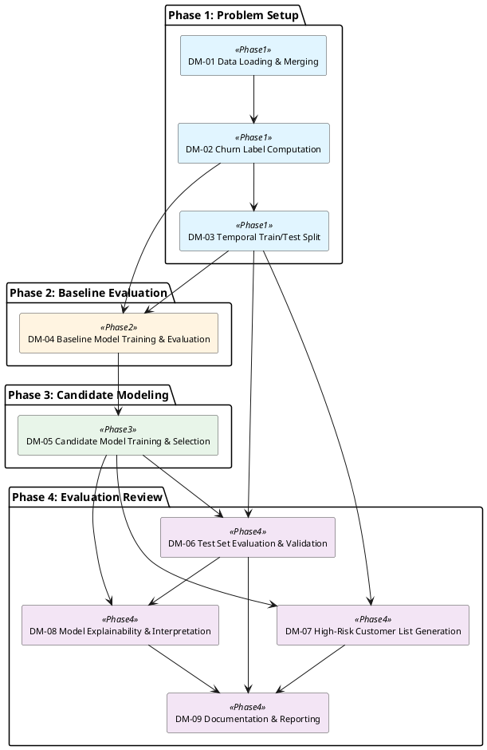

# MASTER DEVELOPMENT BLUEPRINT

> Tài liệu chi tiết: Vấn đề, Giải pháp, Requirements, Modules, Các Phase, Công nghệ và Codebase.

## 0. CODING AGENT CONTRACT

- Luôn ưu tiên G1 requirements và ràng buộc người dùng trước mọi gợi ý kỹ thuật.
- Không dùng benchmark/con số trong CoResearch làm target hoặc ngưỡng pass/fail nếu user chưa xác nhận.
- Mỗi file/hàm cần bám `addresses`/requirement IDs tương ứng; nếu thiếu mapping, ghi rõ TODO/assumption thay vì tự đặt mục tiêu mới.
- Giữ module boundary: module chỉ phụ thuộc module khác khi có input/output contract trực tiếp hoặc dependency đã nêu trong design package.
- Output code nên có test/validation tương ứng với acceptance criteria, không chỉ chạy được về mặt cú pháp.

## 1. VẤN ĐỀ (PROBLEM PROFILE)

**Business Goal:** Xác định khách hàng có nguy cơ rời bỏ cao để triển khai chiến lược giữ chân (retention) nhằm giảm tỷ lệ churn và bảo toàn doanh thu.
**Technical Objective:** Bài toán phân loại nhị phân (binary classification) dự đoán churn với yêu cầu giải thích (interpretability) để hiểu rõ yếu tố ảnh hưởng đến quyết định rời bỏ của khách hàng.

### Success Criteria
- {'target': 'Tham chiếu benchmark AUC-ROC ~0.97 từ nghiên cứu tương tự [cite: cr_0070, cr_0382], nhưng đánh giá thực tế trên dataset người dùng', 'description': 'Mô hình đạt AUC-ROC cao trên tập test của người dùng, đánh giá khả năng phân biệt churner và non-churner', 'criterion_id': 'SC-001', 'verification_method': 'Tính AUC-ROC trên test set được tách từ dữ liệu Olist theo phương pháp temporal validation (tránh data leakage)', 'requires_user_confirmation': False}
- {'target': 'Đạt F1-Score cao nhất có thể trên test set người dùng, cân nhắc tradeoff giữa precision (hiệu quả chiến dịch) và recall (phủ sóng churners)', 'description': 'Mô hình đạt F1-Score tốt trên tập test của người dùng, cân bằng precision và recall', 'criterion_id': 'SC-002', 'verification_method': 'Tính F1-Score trên test set; có thể tối ưu threshold dựa trên business cost nếu user cung cấp', 'requires_user_confirmation': False}
- {'target': 'Đạt Recall cao để tối thiểu hóa false negatives (bỏ sót khách hàng churn thực tế), cân nhắc cost của việc mất khách hàng', 'description': 'Mô hình đạt Recall tốt trên tập test của người dùng, đảm bảo không bỏ sót quá nhiều churners thực tế', 'criterion_id': 'SC-003', 'verification_method': 'Tính Recall trên test set', 'requires_user_confirmation': False}
- {'target': 'Tạo báo cáo/visualizations cho thấy những đặc trưng nào (RFM, hành vi mua hàng, địa lý, v.v.) ảnh hưởng mạnh nhất đến churn', 'description': 'Mô hình cung cấp khả năng giải thích (interpretability) rõ ràng về các yếu tố ảnh hưởng đến dự đoán churn', 'criterion_id': 'SC-004', 'verification_method': 'Sử dụng kỹ thuật explainability (SHAP, feature importance) để trích xuất và trình bày top features quan trọng nhất', 'requires_user_confirmation': False}

### Data Profile
- **Data type:** tabular
- **Volume:** ~100,000 đơn hàng từ tháng 01/2016 đến tháng 08/2018 (32 tháng), ~96,096 khách hàng unique (theo customer_unique_id), 9 bảng CSV quan hệ

### Constraints
**Hạ tầng:**
- Laptop cá nhân không có GPU, chỉ có CPU
- RAM 8GB - giới hạn khả năng xử lý dataset lớn và training model phức tạp trong memory
**Tuân thủ:**
- Dữ liệu đã được ẩn danh hóa (tên công ty/đối tác thay bằng tên Game of Thrones), tuân thủ license CC BY-NC-SA 4.0
**Vấn đề/rủi ro:**
- [Note: RAM giới hạn] RAM 8GB có thể gặp vấn đề khi xử lý toàn bộ dataset (~100K orders × 9 bảng) với feature engineering phức tạp hoặc training ensemble models lớn. Cần cân nhắc batch processing, feature selection, hoặc model selection phù hợp với tài nguyên.
- [Note: Không có GPU] Không thể sử dụng deep learning frameworks yêu cầu GPU (neural networks phức tạp). Ưu tiên tree-based models (LightGBM, XGBoost, Random Forest) hoặc linear models có thể chạy hiệu quả trên CPU.
- [Note: Churn definition] Định nghĩa churn 90 ngày không có đơn hàng mới là giả định nghiệp vụ, có thể không phù hợp cho tất cả các segment khách hàng (VD: khách hàng mua sản phẩm bền có chu kỳ mua hàng dài hơn). Cần xác nhận với user về tính hợp lý của định nghĩa này.
- [Manual Review Required] Không rõ user mong muốn output ở dạng nào: batch prediction trên toàn bộ customer base, API realtime cho single customer, hay notebook analysis? Điều này ảnh hưởng đến thiết kế solution architecture. Gợi ý: Xác nhận execution target và deployment requirements.
**Thông tin còn thiếu:**
- {"field": "business_context.intervention_budget", "fallback": "Không tối ưu threshold dựa trên business cost. Sử dụng threshold mặc định (0.5) hoặc tối ưu F1-Score. Cung cấp precision-recall curve để user tự chọn threshold phù hợp.", "severity": "WARN", "suggestion": "Cung cấp: (1) Chi phí can thiệp trung bình mỗi khách hàng (VD: $10-50 cho email/voucher); (2) Giá trị CLV trung bình hoặc revenue per customer; (3) Ngân sách tổng cho retention campaign nếu có.", "why_needed": "Để tối ưu threshold và đánh giá business impact, cần biết chi phí can thiệp (cost per customer trong retention campaign) và giá trị customer lifetime value (CLV). Điều này giúp cân bằng precision vs recall dựa trên expected value framework."}
- {"field": "data_profile.class_distribution", "fallback": "Giả định có class imbalance (dựa trên CoResearch về 77% churn rate trong e-commerce). Sử dụng class weights trong model training và ưu tiên metrics như AUC-ROC, F1-Score, Precision-Recall thay vì accuracy.", "severity": "WARN", "suggestion": "Sau khi tính churn label, cung cấp tỷ lệ % churners vs non-churners trong training set.", "why_needed": "Cần xác nhận tỷ lệ churn/non-churn thực tế trên dataset người dùng để đánh giá mức độ class imbalance và chọn kỹ thuật xử lý phù hợp (class weights, sampling, threshold tuning)."}
- {"field": "feature_engineering.feature_scope", "fallback": "Giả định: Standard feature engineering - RFM features với một vài time windows (30/60/90 ngày), order statistics (frequency, monetary, avg order value), product category diversity. Tránh features quá phức tạp để phù hợp với RAM 8GB.", "severity": "WARN", "suggestion": "Xác nhận mức độ feature engineering mong muốn: (1) Simple: RFM cơ bản + order statistics; (2) Standard: RFM + temporal features + product category; (3) Advanced: RFM-D multi-window + geospatial + text features từ reviews.", "why_needed": "Cần xác nhận user muốn feature engineering đơn giản (RFM cơ bản) hay phức tạp (RFM-D với multiple time windows, behavioral features, geospatial features). Điều này ảnh hưởng đến độ phức tạp, thời gian xử lý và memory usage."}

---

## 1.1 ANALYSIS TASK GRAPH

### AT-001 — Xây dựng pipeline dự đoán churn cho khách hàng Olist (Primary)
- **Objective:** Tạo ra một hệ thống dự đoán churn hoàn chỉnh bao gồm data preparation, feature engineering, model training, evaluation và explainability, đáp ứng toàn bộ success criteria SC-001 đến SC-004
- **Outputs:** Danh sách khách hàng với xác suất churn và nhãn dự đoán, Báo cáo metrics đánh giá trên test set: AUC-ROC, F1-Score, Recall, Precision, confusion matrix, Explainability artifacts: feature importance ranking, SHAP values hoặc tương đương cho top features ảnh hưởng đến churn, Visualization giải thích các yếu tố chính ảnh hưởng đến churn (RFM, hành vi mua hàng, địa lý)
- **Depends on:** None
- **Validation:** Temporal validation: chia train/test dựa trên cutoff thời gian để tránh data leakage (ví dụ: train trên 01/2016-04/2018, test trên 05/2018-08/2018); Tính toán AUC-ROC, F1-Score, Recall, Precision trên test set với churn labels được tính toán theo định nghĩa 90 ngày; Kiểm tra khả năng giải thích: đảm bảo có thể trích xuất và trình bày top N features quan trọng nhất với điểm số hoặc contribution values; Sanity check: xác minh churn labels không bị data leakage (không dùng thông tin tương lai để dự đoán)

### AT-002 — Chuẩn bị dữ liệu và tính toán churn labels
- **Objective:** Load và merge 9 bảng CSV thành dataset thống nhất, tính toán churn label cho từng khách hàng theo định nghĩa 90 ngày, xử lý missing values và chuẩn bị dữ liệu cho temporal split
- **Outputs:** Dataset đã merge với customer-level aggregation, Cột churn label (binary: 0=active, 1=churned) cho từng customer_unique_id, Dataset metadata: số lượng churners vs non-churners, temporal distribution, Missing value report và imputation strategy
- **Depends on:** None
- **Validation:** Kiểm tra không có data leakage: churn label chỉ dựa trên history trước cutoff time; Xác minh logic tính churn: lấy mẫu một số customers và manually verify churn label dựa trên order dates; Báo cáo class distribution để đánh giá mức độ imbalance; Kiểm tra missing values pattern: nếu missing không random, cần xử lý cẩn thận

### AT-003 — Feature engineering với RAM constraint
- **Objective:** Tạo features có khả năng dự đoán churn (RFM, behavioral, transactional, geospatial) từ 9 bảng dữ liệu, tối ưu hóa memory footprint để phù hợp với RAM 8GB
- **Outputs:** Feature matrix ở customer-level với các nhóm features: RFM (Recency, Frequency, Monetary), behavioral (avg order value, product diversity, review sentiment), transactional (payment methods, installments), geospatial (customer-seller distance, state/city), Feature dictionary giải thích ý nghĩa và cách tính từng feature, Feature correlation analysis để loại bỏ features redundant
- **Depends on:** AT-002
- **Validation:** Kiểm tra memory usage trong quá trình feature engineering, sử dụng batch processing hoặc feature selection nếu vượt ngưỡng; Temporal validation: đảm bảo features chỉ dùng thông tin có sẵn trước cutoff time (không có look-ahead bias); Sanity check: verify một số features bằng cách tính manually cho sample customers; Phân tích correlation matrix để detect multicollinearity và loại bỏ features dư thừa

### AT-004 — Temporal train/test split và xử lý class imbalance
- **Objective:** Chia dataset thành train/test theo thời gian để tránh data leakage, xử lý class imbalance nếu cần thiết (class weights, sampling, threshold tuning)
- **Outputs:** Train set và test set với temporal split (không có data leakage), Class distribution report cho train và test set, Strategy để xử lý class imbalance: class weights, SMOTE/undersampling, hoặc threshold tuning
- **Depends on:** AT-003
- **Validation:** Verify temporal split: kiểm tra không có sample từ test period xuất hiện trong train set; Kiểm tra class distribution trên train và test set: nếu imbalance >70%, cần áp dụng kỹ thuật xử lý; Sanity check: đảm bảo test set đủ lớn và representative (ít nhất 20-30% tổng data)

### AT-005 — Model training và hyperparameter tuning trên CPU
- **Objective:** Train models phù hợp với CPU constraint (tree-based hoặc linear models), thực hiện hyperparameter tuning để tối ưu AUC-ROC và F1-Score, chọn model tốt nhất dựa trên validation metrics
- **Outputs:** Trained models: ít nhất 2-3 candidates (ví dụ: LightGBM, XGBoost, Logistic Regression), Hyperparameter tuning results: best hyperparameters cho mỗi model, Model selection report: so sánh models dựa trên validation AUC-ROC, F1, Recall, training time, Best model artifact (serialized model file)
- **Depends on:** AT-004
- **Validation:** Cross-validation trên train set (time-series cross-validation để tránh data leakage); Đánh giá trên validation fold: AUC-ROC, F1-Score, Recall, Precision, training time; Chọn model tốt nhất dựa trên validation metrics và interpretability tradeoff; Monitor memory usage để đảm bảo không vượt 8GB RAM

### AT-006 — Model evaluation trên test set
- **Objective:** Đánh giá model tốt nhất trên test set với đầy đủ metrics (AUC-ROC, F1-Score, Recall, Precision, confusion matrix), threshold tuning nếu cần, tạo predictions cho toàn bộ customers trong test set
- **Outputs:** Test set metrics: AUC-ROC, F1-Score, Recall, Precision, Accuracy, Confusion matrix và classification report, Predictions cho test set: customer_id, churn_probability, churn_prediction, Threshold tuning analysis: tìm optimal threshold nếu user cung cấp business cost information, ROC curve và Precision-Recall curve
- **Depends on:** AT-005
- **Validation:** Tính toán metrics trên test set và so sánh với benchmark từ literature (AUC-ROC ~0.97); Phân tích confusion matrix để hiểu distribution của false positives và false negatives; Nếu có business cost info, tối ưu threshold để minimize total cost; Sanity check: verify predictions trên một số sample customers

### AT-007 — Explainability analysis và feature importance
- **Objective:** Tạo explainability artifacts để hiểu các yếu tố ảnh hưởng đến churn predictions, đáp ứng SC-004 bằng cách trích xuất feature importance, SHAP values hoặc tương đương, và tạo visualizations
- **Outputs:** Global explainability: feature importance ranking (top 10-20 features quan trọng nhất), SHAP values hoặc equivalent (permutation importance, partial dependence plots) cho top features, Visualizations: feature importance bar chart, SHAP summary plot, SHAP dependence plots cho top features, Interpretation report: giải thích business meaning của top features (ví dụ: Recency cao → high churn risk, Frequency thấp → high churn risk), Optional: local explainability cho một số high-risk customers (SHAP waterfall plots)
- **Depends on:** AT-005, AT-006
- **Validation:** Verify feature importance có ý nghĩa business logic (ví dụ: RFM features nên nằm trong top features); Cross-check feature importance với domain knowledge từ literature; Kiểm tra SHAP values có nhất quán với feature importance ranking; Review interpretation report với sample customers để đảm bảo explanations hợp lý

### AT-008 — Tạo final deliverables và documentation
- **Objective:** Tổng hợp toàn bộ outputs từ các tasks trước thành deliverables cuối cùng: prediction list, evaluation report, explainability report, và documentation đầy đủ để business users sử dụng
- **Outputs:** High-risk customer list: CSV hoặc Excel file chứa customer_id, churn_probability, churn_prediction, sorted by probability descending, Evaluation report: PDF hoặc HTML với metrics, confusion matrix, ROC curve, PR curve, Explainability report: PDF hoặc HTML với feature importance, SHAP plots, business interpretation, Technical documentation: data preparation steps, feature engineering logic, model selection rationale, training configuration, reproduction instructions, Optional: Jupyter notebook hoặc Python script để reproduce toàn bộ pipeline
- **Depends on:** AT-006, AT-007
- **Validation:** Review final deliverables để đảm bảo đầy đủ thông tin và dễ hiểu cho non-technical stakeholders; Test reproduction instructions trên một environment sạch để verify completeness; Sanity check customer list: verify top high-risk customers có profile hợp lý

---

## 2. GIẢI PHÁP (SOLUTION STRATEGY)

- **Family:** Gradient Boosting-based Churn Prediction với RFM-D Feature Engineering
- **Rationale:** LightGBM hoặc XGBoost là lựa chọn tối ưu vì: (1) Đạt performance cao (AUC-ROC ~0.97 theo CoResearch cr_0200, cr_0070) trên CPU; (2) Built-in support cho class imbalance và missing data; (3) Training time chấp nhận được (10-15 phút LightGBM, 30 phút XGBoost theo CoResearch cr_0342); (4) Cung cấp feature importance và tương thích với SHAP để đáp ứng yêu cầu explainability; (5) Memory footprint hợp lý cho RAM 8GB constraint. RFM-D framework với temporal disaggregation (cr_0134) phù hợp với e-commerce behavior và tăng khả năng dự đoán so với RFM truyền thống.


---

## 3. YÊU CẦU (REQUIREMENTS)

> Danh sách này mô tả những điều kiện agent hiểu là cần có để giải quyết đúng bài toán. User nên đọc và đánh giá nội dung, không phải một schema traceability bắt buộc.

- **FR-01**: Định nghĩa churn label dựa trên ngưỡng 90 ngày
  - Requirement: Mỗi khách hàng (customer_unique_id) phải được gán nhãn churn nhị phân: churned (1) nếu không có đơn hàng mới nào trong 90 ngày liên tục kể từ đơn hàng cuối cùng của họ, active (0) nếu ngược lại. Logic tính toán phải dựa trên order_purchase_timestamp từ bảng olist_orders_dataset.csv và cutoff date của test period.
  - Vì sao cần: Required to keep the requirement tied to the user problem and downstream validation.
  - Cách kiểm tra/xác nhận: ["Lấy mẫu 10 customers ngẫu nhiên, manually verify nhãn churn bằng cách kiểm tra khoảng cách giữa đơn hàng cuối cùng và cutoff date", "Báo cáo class distribution (tỷ lệ churned vs active) trên toàn bộ dataset và trên train/test set", "Không có data leakage: churn label chỉ dùng thông tin đơn hàng trước cutoff time của test period"]
- **FR-02**: Temporal validation để tránh data leakage
  - Requirement: Dataset phải được chia thành train và test set dựa trên cutoff thời gian (ví dụ: train từ 01/2016-04/2018, test từ 05/2018-08/2018). Không được shuffle ngẫu nhiên theo row. Tất cả features và churn labels trong train set chỉ được tính từ thông tin có sẵn trước cutoff time, không sử dụng thông tin từ test period.
  - Vì sao cần: Required to keep the requirement tied to the user problem and downstream validation.
  - Cách kiểm tra/xác nhận: ["Verify không có sample nào từ test period xuất hiện trong train set", "Kiểm tra features trong train set: đảm bảo không có feature nào tính từ thông tin sau cutoff time (ví dụ: Recency, Frequency phải tính dựa trên orders trước cutoff)", "Test set đủ lớn và representative (ít nhất 20-30% tổng data hoặc tối thiểu vài nghìn customers)"]
- **FR-03**: Feature engineering từ 9 bảng CSV với nhóm features RFM, behavioral, transactional, geospatial
  - Requirement: Tạo feature matrix ở customer-level (mỗi row là một customer_unique_id) từ 9 bảng CSV. Features bao gồm: (1) RFM: Recency (số ngày kể từ đơn hàng cuối), Frequency (số đơn hàng), Monetary (tổng chi tiêu); (2) Behavioral: trung bình giá trị đơn hàng, số lượng product categories khác nhau, sentiment từ review_score; (3) Transactional: phương thức thanh toán ưu tiên, số lần trả góp trung bình; (4) Geospatial: khoảng cách trung bình customer-seller, state/city của customer. Tất cả features phải tuân thủ temporal validation (chỉ dùng thông tin trước cutoff time).
  - Vì sao cần: Required to keep the requirement tied to the user problem and downstream validation.
  - Cách kiểm tra/xác nhận: ["Feature matrix có dạng customer-level: mỗi row tương ứng với một customer_unique_id duy nhất", "Tất cả 4 nhóm features (RFM, behavioral, transactional, geospatial) đều được tạo và có feature dictionary giải thích ý nghĩa", "Sanity check: lấy 5 customers mẫu, manually verify một số features (ví dụ: Frequency, Monetary, Recency) bằng cách đếm/tính từ raw data", "Feature correlation analysis: loại bỏ features có correlation >0.95 để giảm redundancy"]
- **FR-04**: Memory footprint phải phù hợp với RAM 8GB
  - Requirement: Toàn bộ pipeline từ data loading, feature engineering đến model training phải chạy được trên máy laptop với RAM 8GB. Nếu memory usage vượt ngưỡng an toàn (~6GB), cần áp dụng batch processing, feature selection, hoặc downcast dtype (ví dụ: float64 → float32).
  - Vì sao cần: Required to keep the requirement tied to the user problem and downstream validation.
  - Cách kiểm tra/xác nhận: ["Monitor memory usage tại các điểm then chốt: sau khi load 9 bảng CSV, sau khi merge thành customer-level, sau khi tạo features, trong quá trình training", "Nếu memory usage vượt 6GB, báo cáo và áp dụng optimization (batch processing, feature selection, downcast dtype)", "Pipeline chạy thành công từ đầu đến cuối trên môi trường RAM 8GB mà không crash"]
- **FR-05**: Model training trên CPU với tree-based hoặc linear models
  - Requirement: Chỉ train các loại model phù hợp với CPU constraint: tree-based models (LightGBM, XGBoost, Random Forest) hoặc linear models (Logistic Regression, Ridge). Không train deep learning models hoặc models yêu cầu GPU. Hyperparameter tuning phải sử dụng time-series cross-validation để tránh data leakage, với search space phù hợp với CPU training time (ví dụ: RandomizedSearchCV thay vì GridSearchCV nếu search space lớn).
  - Vì sao cần: Required to keep the requirement tied to the user problem and downstream validation.
  - Cách kiểm tra/xác nhận: ["Train ít nhất 2-3 model candidates (ví dụ: LightGBM, XGBoost, Logistic Regression)", "Hyperparameter tuning sử dụng time-series cross-validation (TimeSeriesSplit hoặc tương đương)", "Báo cáo validation metrics (AUC-ROC, F1-Score, Recall) và training time cho mỗi model", "Chọn best model dựa trên validation metrics, cân nhắc tradeoff giữa performance và interpretability"]
- **FR-06**: Đánh giá model trên test set với metrics AUC-ROC, F1-Score, Recall
  - Requirement: Model tốt nhất phải được đánh giá trên test set với 3 metrics do user xác nhận: AUC-ROC (đo khả năng phân biệt churner vs non-churner), F1-Score (cân bằng precision và recall), và Recall (đảm bảo không bỏ sót churners thực tế). Báo cáo phải bao gồm confusion matrix, classification report, ROC curve và Precision-Recall curve. Nếu user cung cấp business cost information, cần threshold tuning để tối ưu total cost.
  - Vì sao cần: Required to keep the requirement tied to the user problem and downstream validation.
  - Cách kiểm tra/xác nhận: ["Test set metrics được tính toán chính xác: AUC-ROC, F1-Score, Recall, Precision, Accuracy", "Confusion matrix và classification report được trình bày rõ ràng (số lượng TP, TN, FP, FN)", "ROC curve và Precision-Recall curve được visualize để hiểu tradeoff giữa metrics", "So sánh với benchmark từ literature (AUC-ROC ~0.97 từ CoResearch references), giải thích nếu có gap lớn"]
- **FR-07**: Explainability artifacts: feature importance và SHAP values
  - Requirement: Pipeline phải tạo explainability artifacts để giải thích các yếu tố ảnh hưởng đến churn predictions. Bao gồm: (1) Global explainability: feature importance ranking (top 10-20 features quan trọng nhất); (2) SHAP values hoặc equivalent (permutation importance, partial dependence plots) cho top features; (3) Visualizations: feature importance bar chart, SHAP summary plot, SHAP dependence plots cho top features. Interpretation report phải giải thích business meaning của top features (ví dụ: Recency cao → high churn risk).
  - Vì sao cần: Required to keep the requirement tied to the user problem and downstream validation.
  - Cách kiểm tra/xác nhận: ["Feature importance ranking được trích xuất từ best model (tree-based models có built-in feature importance, linear models dùng coefficient magnitude)", "SHAP values hoặc equivalent được tính toán cho top 10-20 features", "Visualizations được tạo: feature importance bar chart, SHAP summary plot, SHAP dependence plots", "Interpretation report giải thích business meaning của top features, verify logic có hợp lý với domain knowledge (ví dụ: RFM features nên nằm trong top)"]
- **FR-08**: High-risk customer list cho marketing/CRM
  - Requirement: Output cuối cùng phải bao gồm danh sách khách hàng có nguy cơ churn cao (churn_probability > threshold, ví dụ 0.5 hoặc threshold được tối ưu từ AT-006). Danh sách phải chứa: customer_id, churn_probability, churn_prediction (0/1), và có thể thêm top 3-5 features quan trọng nhất cho mỗi customer để hỗ trợ personalized intervention. Format: CSV hoặc Excel file, dễ sử dụng cho business users.
  - Vì sao cần: Required to keep the requirement tied to the user problem and downstream validation.
  - Cách kiểm tra/xác nhận: ["File CSV/Excel chứa customer_id, churn_probability, churn_prediction cho tất cả customers trong test set hoặc toàn bộ dataset", "Danh sách được sắp xếp theo churn_probability giảm dần (high-risk customers ở đầu)", "Nếu có thêm top features cho mỗi customer (local explainability), verify trên 5 customers mẫu để đảm bảo đúng logic", "Format file dễ mở và sử dụng cho business users (UTF-8 encoding, header rõ ràng)"]
- **FR-09**: Class imbalance handling nếu churn rate <30% hoặc >70%
  - Requirement: Sau khi tính churn labels trên dataset Olist, nếu class distribution bị imbalance nghiêm trọng (churn rate <30% hoặc >70%), pipeline phải áp dụng kỹ thuật xử lý class imbalance: class weights trong model training, hoặc sampling techniques (SMOTE, undersampling), hoặc threshold tuning sau khi train. Lựa chọn kỹ thuật phải dựa trên validation metrics (ưu tiên Recall và F1-Score).
  - Vì sao cần: Required to keep the requirement tied to the user problem and downstream validation.
  - Cách kiểm tra/xác nhận: ["Báo cáo class distribution trên train và test set sau khi tính churn labels", "Nếu churn rate <30% hoặc >70%, áp dụng ít nhất một kỹ thuật xử lý class imbalance", "So sánh metrics (đặc biệt là Recall và F1-Score) trước và sau khi xử lý class imbalance trên validation set", "Chọn kỹ thuật tốt nhất dựa trên validation metrics, giải thích lựa chọn"]
- **FR-10**: Documentation đầy đủ cho business users và technical users
  - Requirement: Final deliverables phải bao gồm documentation đầy đủ: (1) Evaluation report: tổng hợp test set metrics, confusion matrix, visualizations, so sánh với benchmark; (2) Explainability report: feature importance, SHAP analysis, interpretation của top features; (3) Technical documentation: mô tả pipeline, feature engineering logic, model architecture, hyperparameters, cách reproduce kết quả; (4) User guide: hướng dẫn business users sử dụng high-risk customer list và interpret predictions.
  - Vì sao cần: Required to keep the requirement tied to the user problem and downstream validation.
  - Cách kiểm tra/xác nhận: ["Evaluation report chứa đầy đủ test set metrics, confusion matrix, ROC curve, PR curve, so sánh với benchmark", "Explainability report chứa feature importance ranking, SHAP visualizations, interpretation của top features với business meaning", "Technical documentation mô tả pipeline architecture, feature engineering logic, model selection rationale, hyperparameters", "User guide hướng dẫn business users đọc high-risk customer list, interpret churn_probability và top features"]

---

## 4. CÁC PHASE (HIGH-LEVEL PIPELINE)

### Phase 1: Problem Setup
- **Mục tiêu:** Thiết lập nền tảng cho pipeline dự đoán churn: load và merge 9 bảng CSV từ Olist dataset thành customer-level dataset, tính toán churn labels theo định nghĩa 90 ngày, thực hiện temporal train/test split để tránh data leakage, và validate tính đúng đắn của labels cũng như phân bố dữ liệu. Phase này đảm bảo dữ liệu sạch, đúng cấu trúc, và sẵn sàng cho feature engineering.
  - **Step 1.1**: Load và merge dataset (pandas)
    - Input: 9 bảng CSV từ Olist dataset (olist_orders_dataset.csv, olist_customers_dataset.csv, olist_order_items_dataset.csv, v.v.)
    - Output: Customer-level merged dataframe với tất cả thông tin từ 9 bảng, mỗi row tương ứng một customer_unique_id
    - Addresses: FR-04
  - **Step 1.2**: Tính churn labels (pandas)
    - Input: Customer-level dataframe với order_purchase_timestamp
    - Output: Customer-level dataframe với cột churn label nhị phân (0/1) và báo cáo class distribution
    - Addresses: FR-01
  - **Step 1.3**: Temporal train/test split (pandas)
    - Input: Customer-level dataframe với churn labels
    - Output: Train set và test set đã được chia temporal, với validation report xác nhận không có data leakage và class distribution representative
    - Addresses: FR-02
### Phase 2: Baseline Evaluation
- **Mục tiêu:** Đánh giá baseline model đơn giản (Logistic Regression với RFM cơ bản) để thiết lập performance floor và xác thực pipeline end-to-end trước khi triển khai gradient boosting phức tạp. Phase này giúp phát hiện sớm vấn đề về data leakage, class imbalance, và temporal split logic.
  - **Step 2.1**: Train baseline Logistic Regression (scikit-learn (LogisticRegression, StandardScaler))
    - Input: Train set với features RFM cơ bản (Recency, Frequency, Monetary) và churn labels
    - Output: Trained Logistic Regression model và fitted StandardScaler
  - **Step 2.2**: Đánh giá baseline trên test set (scikit-learn (metrics module))
    - Input: Trained Logistic Regression model, fitted StandardScaler, test set với features và labels
    - Output: Baseline metrics (AUC-ROC, AUC-PR, F1, Recall, Precision), confusion matrix, Precision-Recall curve, ROC curve [Self-Inferred]
  - **Step 2.3**: Xác thực temporal split và data leakage (pandas)
    - Input: Train set và test set với timestamps từ orders
    - Output: Validation report: temporal split correctness assertion, class distribution (tỷ lệ churned vs active) trên train và test set [Self-Inferred]
### Phase 3: Candidate Modeling
- **Mục tiêu:** Train và so sánh nhiều model candidates (LightGBM, XGBoost, Logistic Regression) trên train set với time-series cross-validation, áp dụng class imbalance handling và hyperparameter tuning, nhằm chọn ra model tốt nhất dựa trên validation metrics (AUC-ROC, F1-Score, Recall) trên dữ liệu người dùng. Đảm bảo toàn bộ quá trình chạy được trên CPU và RAM 8GB.
  - **Step 3.1**: Baseline model training với class imbalance handling (LightGBM, XGBoost, scikit-learn)
    - Input: Feature matrix từ Phase 2 với churn labels; train/validation split theo temporal cutoff
    - Output: 3 baseline models đã train; validation metrics ban đầu (AUC-ROC, F1-Score, Recall) cho từng model
    - Addresses: FR-05, FR-06
  - **Step 3.2**: Time-series cross-validation (scikit-learn TimeSeriesSplit)
    - Input: 3 baseline models từ step 3.1; train set với temporal ordering
    - Output: Cross-validation metrics (mean ± std của AUC-ROC, F1-Score, Recall) cho từng model; ranking models theo validation performance
    - Addresses: FR-02, FR-05, FR-06
  - **Step 3.3**: Hyperparameter tuning cho top model (scikit-learn RandomizedSearchCV, LightGBM/XGBoost)
    - Input: Top models từ step 3.2; train set; search space và CV strategy
    - Output: Best model với hyperparameters đã tune; final validation metrics; model artifacts sẵn sàng cho evaluation trên test set trong Phase 4
    - Addresses: FR-05, FR-06
### Phase 4: Evaluation Review
- **Mục tiêu:** Đánh giá performance của model trên test set theo temporal validation protocol, tính toán metrics AUC-ROC/F1-Score/Recall/Precision trên dataset người dùng, kiểm tra tính đúng đắn của temporal split và churn labels, báo cáo confusion matrix và classification report, đảm bảo đáp ứng SC-001, SC-002, SC-003 từ G1
  - **Step 4.1**: Validation kiểm tra temporal split và churn labels (pandas)
    - Input: Train set, test set với order_purchase_timestamp và churn labels
    - Output: Báo cáo validation: temporal split correctness, churn label correctness trên sample customers, class distribution (tỷ lệ churned vs active) trên train/test
    - Addresses: FR-01, FR-02
  - **Step 4.2**: Tính toán metrics trên test set (scikit-learn)
    - Input: Trained model từ Phase 3, test set features và ground truth churn labels
    - Output: Metrics report: AUC-ROC, AUC-PR, F1-Score, Recall, Precision tại optimal threshold và multiple thresholds, confusion matrix, classification report (precision/recall/F1 per class)
    - Addresses: FR-06
  - **Step 4.3**: Visualization kết quả đánh giá (matplotlib)
    - Input: Predictions và metrics từ step 4.2
    - Output: Visualization artifacts: ROC curve với AUC-ROC score, Precision-Recall curve với AUC-PR score, confusion matrix heatmap
    - Addresses: FR-06

---

## 5. CÔNG NGHỆ (TECHNOLOGY STACK)

| Task | Final Solution | Type | Addresses | Rationale / Trade-off |
|---|---|---|---|---|
|  |  |  |  |  |
|  |  |  |  |  |
|  |  |  |  |  |
|  |  |  |  |  |
|  |  |  |  |  |
|  |  |  |  |  |

---

## 6. MODULE & HIGH-LEVEL DESIGN (MODULAR DESIGN PACKAGE)

### DM-01 — Data Loading & Merging
- **Purpose:** Load 9 bảng CSV từ Olist dataset và merge thành customer-level dataframe với memory optimization (dtype downcast, batch processing nếu cần) để đảm bảo chạy được trên RAM 8GB
- **Phase IDs:** 1
- **Step IDs:** 1.1
- **Owned requirements:** FR-04
- **Inputs:** 9 bảng CSV từ Olist dataset (olist_orders_dataset.csv, olist_customers_dataset.csv, olist_order_items_dataset.csv, v.v.)
- **Outputs:** Customer-level merged dataframe với tất cả thông tin từ 9 bảng, mỗi row tương ứng một customer_unique_id
- **Depends on:** N/A
- **Downstream consumers:** DM-02
- **Invariants:**
  - Memory usage không vượt quá 6GB RAM tại bất kỳ thời điểm nào
  - Mỗi customer_unique_id xuất hiện duy nhất một lần trong merged dataframe
  - Các foreign keys (order_id, product_id) được preserve đúng sau merge

### DM-02 — Churn Label Computation
- **Purpose:** Tính toán churn label nhị phân (0/1) cho từng customer dựa trên định nghĩa 90 ngày không hoạt động kể từ đơn hàng cuối cùng đến cutoff date, validate bằng manual sampling và báo cáo class distribution
- **Phase IDs:** 1
- **Step IDs:** 1.2
- **Owned requirements:** FR-01
- **Inputs:** Customer-level dataframe với order_purchase_timestamp
- **Outputs:** Customer-level dataframe với cột churn label nhị phân (0/1) và báo cáo class distribution
- **Depends on:** DM-01
- **Downstream consumers:** DM-03, DM-04
- **Invariants:**
  - Churn label = 1 nếu và chỉ nếu (cutoff_date - last_order_date) > 90 ngày
  - Churn label = 0 nếu (cutoff_date - last_order_date) <= 90 ngày
  - Không có missing values trong cột churn label
  - Class distribution được báo cáo với tỷ lệ % rõ ràng

### DM-03 — Temporal Train/Test Split
- **Purpose:** Chia dataset thành train và test set theo cutoff thời gian để đảm bảo temporal validation và tránh data leakage, validate tính đúng đắn của split và class distribution trên cả hai tập
- **Phase IDs:** 1
- **Step IDs:** 1.3
- **Owned requirements:** FR-02
- **Inputs:** Customer-level dataframe với churn labels
- **Outputs:** Train set và test set đã được chia temporal, với validation report xác nhận không có data leakage và class distribution representative
- **Depends on:** DM-02
- **Downstream consumers:** DM-04, DM-06, DM-07
- **Invariants:**
  - Không có order nào từ test period xuất hiện trong train set
  - Train set chỉ chứa orders trước cutoff time
  - Test set chỉ chứa orders từ cutoff time trở đi
  - Test set chiếm ít nhất 20-30% tổng data
  - Class distribution trên train và test set được báo cáo và representative

### DM-04 — Baseline Model Training & Evaluation
- **Purpose:** Train baseline Logistic Regression với RFM cơ bản, đánh giá metrics trên test set, và xác thực temporal split logic để thiết lập performance floor trước khi triển khai gradient boosting
- **Phase IDs:** 2
- **Step IDs:** 2.1, 2.2, 2.3
- **Owned requirements:** N/A
- **Inputs:** Train set với features RFM cơ bản (Recency, Frequency, Monetary) và churn labels, Test set với features RFM cơ bản và churn labels
- **Outputs:** Baseline metrics (AUC-ROC, AUC-PR, F1, Recall, Precision), Confusion matrix, Precision-Recall curve, ROC curve, Validation report: temporal split correctness assertion, class distribution
- **Depends on:** DM-03, DM-02
- **Downstream consumers:** DM-05
- **Invariants:**
  - Baseline model sử dụng class_weight='balanced' để xử lý class imbalance
  - Features được chuẩn hóa bằng StandardScaler trước khi train
  - Metrics được tính trên test set theo temporal validation
  - Không có data leakage từ test period vào train set

### DM-05 — Candidate Model Training & Selection
- **Purpose:** Train và so sánh nhiều model candidates (LightGBM, XGBoost, Logistic Regression) với time-series cross-validation, áp dụng class imbalance handling và hyperparameter tuning, chọn best model dựa trên validation metrics
- **Phase IDs:** 3
- **Step IDs:** 3.1, 3.2, 3.3
- **Owned requirements:** FR-05, FR-06, FR-09
- **Inputs:** Feature matrix từ Phase 2 (Feature Engineering) với churn labels, Train/validation split theo temporal cutoff
- **Outputs:** Best model với hyperparameters đã tune, Final validation metrics (AUC-ROC, F1-Score, Recall), Model artifacts sẵn sàng cho evaluation trên test set
- **Depends on:** DM-04
- **Downstream consumers:** DM-06, DM-07, DM-08
- **Invariants:**
  - Class imbalance được xử lý qua scale_pos_weight hoặc class_weight='balanced'
  - Time-series cross-validation (TimeSeriesSplit) được sử dụng để tránh data leakage
  - Hyperparameter tuning chỉ chạy trên train set, không touch test set
  - Training time phù hợp với CPU constraint (RandomizedSearchCV với n_iter giới hạn)
  - Validation metrics (mean ± std) được báo cáo cho tất cả models

### DM-06 — Test Set Evaluation & Validation
- **Purpose:** Đánh giá best model trên test set theo temporal validation protocol, tính toán metrics (AUC-ROC, F1-Score, Recall, Precision), validate tính đúng đắn của temporal split và churn labels, tạo visualizations
- **Phase IDs:** 4
- **Step IDs:** 4.1, 4.2, 4.3
- **Owned requirements:** FR-01, FR-02, FR-06
- **Inputs:** Trained model từ Phase 3, Test set features và ground truth churn labels, Train set với order_purchase_timestamp và churn labels
- **Outputs:** Metrics report: AUC-ROC, AUC-PR, F1-Score, Recall, Precision, Confusion matrix và classification report, Visualization artifacts: ROC curve, Precision-Recall curve, confusion matrix heatmap, Báo cáo validation: temporal split correctness, churn label correctness
- **Depends on:** DM-05, DM-03
- **Downstream consumers:** DM-08, DM-09
- **Invariants:**
  - Test set metrics chỉ được tính một lần duy nhất sau khi model được finalize
  - Temporal split validation: không có order nào từ test period trong train set
  - Churn label validation: manual verify trên 10-20 customers sample
  - Metrics được tính tại multiple thresholds để hiểu tradeoff
  - Visualizations phải rõ ràng và dễ interpret cho business users

### DM-07 — High-Risk Customer List Generation
- **Purpose:** Tạo danh sách khách hàng có nguy cơ churn cao (churn_probability > threshold) với customer_id, churn_probability, churn_prediction, và optional top features cho personalized intervention, xuất file CSV/Excel cho business users
- **Phase IDs:** 4
- **Step IDs:** N/A
- **Owned requirements:** FR-08
- **Inputs:** Trained model từ Phase 3, Test set hoặc toàn bộ dataset với features, Optimal threshold từ evaluation
- **Outputs:** CSV/Excel file chứa customer_id, churn_probability, churn_prediction, Danh sách được sắp xếp theo churn_probability giảm dần
- **Depends on:** DM-05, DM-03
- **Downstream consumers:** DM-09
- **Invariants:**
  - File CSV/Excel có UTF-8 encoding và header rõ ràng
  - Danh sách được sắp xếp theo churn_probability giảm dần
  - Churn_prediction được tính dựa trên optimal threshold từ evaluation
  - File format dễ mở và sử dụng cho business users (không có technical jargon)

### DM-08 — Model Explainability & Interpretation
- **Purpose:** Tạo explainability artifacts bao gồm feature importance ranking, SHAP values/equivalent, visualizations, và interpretation report để giải thích business meaning của top features ảnh hưởng đến churn predictions
- **Phase IDs:** 4
- **Step IDs:** N/A
- **Owned requirements:** FR-07
- **Inputs:** Best model từ Phase 3, Feature matrix với feature names, Test set predictions
- **Outputs:** Feature importance ranking (top 10-20 features), SHAP values hoặc equivalent (permutation importance, partial dependence plots), Visualizations: feature importance bar chart, SHAP summary plot, SHAP dependence plots, Interpretation report giải thích business meaning của top features
- **Depends on:** DM-05, DM-06
- **Downstream consumers:** DM-09
- **Invariants:**
  - Feature importance được trích xuất từ model (built-in hoặc permutation-based)
  - Top features phải có business meaning hợp lý (ví dụ: RFM features nên nằm trong top)
  - Visualizations rõ ràng và dễ hiểu cho cả technical và non-technical audiences
  - Interpretation report giải thích tại sao feature quan trọng (ví dụ: Recency cao → high churn risk)

### DM-09 — Documentation & Reporting
- **Purpose:** Tạo final deliverables bao gồm evaluation report, explainability report, technical documentation, và user guide để đảm bảo pipeline có thể reproduce và business users có thể sử dụng high-risk customer list hiệu quả
- **Phase IDs:** 4
- **Step IDs:** N/A
- **Owned requirements:** FR-10
- **Inputs:** Test set metrics từ DM-06, Explainability artifacts từ DM-08, Pipeline architecture và feature engineering logic, High-risk customer list từ DM-07
- **Outputs:** Evaluation report: test set metrics, confusion matrix, visualizations, so sánh với benchmark, Explainability report: feature importance, SHAP analysis, interpretation của top features, Technical documentation: pipeline architecture, feature engineering logic, model selection rationale, hyperparameters, User guide: hướng dẫn business users sử dụng high-risk customer list và interpret predictions
- **Depends on:** DM-06, DM-07, DM-08
- **Downstream consumers:** N/A
- **Invariants:**
  - Evaluation report so sánh với benchmark từ literature (AUC-ROC ~0.97)
  - Technical documentation đủ chi tiết để reproduce kết quả
  - User guide không có technical jargon và dễ hiểu cho business users
  - Tất cả reports được format rõ ràng với headers, tables, visualizations phù hợp

### Module Interaction PlantUML



---

## 7. CODEBASE ĐẦY ĐỦ CHI TIẾT (EXECUTION BLUEPRINT)

## PART A: Codebase Structure
```text
project_root/
├── src/
│   ├── data_loading/
│   │   ├── loader.py
│   │   ├── merger.py
│   │   ├── memory_monitor.py
│   │   └── config.py
│   ├── churn_labeling/
│   │   ├── label_calculator.py
│   │   ├── validator.py
│   │   └── config.py
│   ├── data_splitting/
│   │   ├── temporal_splitter.py
│   │   ├── validator.py
│   │   └── config.py
│   ├── baseline/
│   │   ├── feature_engineering.py
│   │   ├── trainer.py
│   │   ├── evaluator.py
│   │   └── visualizer.py
│   ├── modeling/
│   │   ├── feature_engineering.py
│   │   ├── imbalance_handler.py
│   │   ├── trainer.py
│   │   ├── tuner.py
│   │   ├── selector.py
│   │   └── config.py
│   ├── evaluation/
│   │   ├── evaluator.py
│   │   ├── validator.py
│   │   ├── visualizer.py
│   │   └── report_generator.py
│   ├── high_risk_list/
│   │   ├── generator.py
│   │   ├── exporter.py
│   │   └── config.py
│   ├── explainability/
│   │   ├── feature_importance.py
│   │   ├── shap_analyzer.py
│   │   ├── visualizer.py
│   │   └── interpreter.py
│   ├── documentation/
│   │   ├── evaluation_report.py
│   │   ├── explainability_report.py
│   │   ├── technical_doc.py
│   │   └── user_guide.py
│   └── utils/
│       ├── logger.py
│       ├── config_loader.py
│       ├── file_io.py
│       └── validators.py
├── pipelines/
│   ├── full_pipeline.py
│   ├── baseline_pipeline.py
│   └── config.yaml
├── tests/
│   ├── test_data_loading.py
│   ├── test_churn_labeling.py
│   ├── test_data_splitting.py
│   ├── test_modeling.py
│   ├── test_evaluation.py
│   └── conftest.py
├── notebooks/
│   ├── 01_data_exploration.ipynb
│   ├── 02_churn_definition_validation.ipynb
│   ├── 03_feature_engineering_prototyping.ipynb
│   └── 04_model_selection_experiments.ipynb
├── data/
│   ├── raw/                 # 9 CSV files từ Olist dataset
│   ├── processed/           # Customer-level merged dataframe
│   ├── features/            # Feature matrices
│   └── splits/              # Train/test splits
├── models/
│   ├── baseline/            # Baseline model artifacts
│   └── production/          # Best model artifacts
├── outputs/
│   ├── high_risk_lists/     # CSV/Excel files
│   ├── reports/             # Evaluation và explainability reports
│   ├── visualizations/      # Charts và plots
│   └── documentation/       # Technical docs và user guides
├── configs/
│   ├── data_loading.yaml
│   ├── churn_labeling.yaml
│   ├── modeling.yaml
│   └── pipeline.yaml
├── requirements.txt
├── README.md
└── setup.py
```

## PART A.1: Codebase Modules
### `CB-01` — `src/data_loading/`
- **Design module:** DM-01
- **Responsibility:** Load 9 bảng CSV từ Olist dataset, merge thành customer-level dataframe với memory optimization (dtype downcast, batch processing) để đảm bảo chạy trên RAM 8GB
- **Owned requirements:** FR-04
- **Files:**
  - `src/data_loading/loader.py` — Load từng bảng CSV với dtype optimization và validation schema
  - `src/data_loading/merger.py` — Merge 9 bảng thành customer-level dataframe với memory-efficient joins
  - `src/data_loading/memory_monitor.py` — Monitor memory usage và trigger batch processing nếu vượt threshold 6GB
  - `src/data_loading/config.py` — Configuration cho file paths, dtype mappings, batch sizes

### `CB-02` — `src/churn_labeling/`
- **Design module:** DM-02
- **Responsibility:** Tính toán churn label nhị phân (0/1) cho từng customer dựa trên định nghĩa 90 ngày không hoạt động từ đơn hàng cuối cùng đến cutoff date, validate bằng manual sampling và báo cáo class distribution
- **Owned requirements:** FR-01
- **Files:**
  - `src/churn_labeling/label_calculator.py` — Tính churn label dựa trên order_purchase_timestamp và 90-day rule
  - `src/churn_labeling/validator.py` — Manual sampling validation cho 10 customers, báo cáo class distribution
  - `src/churn_labeling/config.py` — Configuration cho churn window (90 days), cutoff date

### `CB-03` — `src/data_splitting/`
- **Design module:** DM-03
- **Responsibility:** Chia dataset thành train và test set theo cutoff thời gian để đảm bảo temporal validation và tránh data leakage, validate tính đúng đắn của split và class distribution
- **Owned requirements:** FR-02
- **Files:**
  - `src/data_splitting/temporal_splitter.py` — Temporal train/test split dựa trên cutoff date, không shuffle
  - `src/data_splitting/validator.py` — Validate temporal correctness, detect data leakage, verify class distribution
  - `src/data_splitting/config.py` — Configuration cho temporal cutoff date, train/test ratio

### `CB-04` — `src/baseline/`
- **Design module:** DM-04
- **Responsibility:** Train baseline Logistic Regression với RFM cơ bản, đánh giá metrics trên test set, validate temporal split logic để thiết lập performance floor
- **Owned requirements:** N/A
- **Files:**
  - `src/baseline/feature_engineering.py` — Tạo RFM features cơ bản (Recency, Frequency, Monetary) từ customer-level dataframe
  - `src/baseline/trainer.py` — Train Logistic Regression baseline với default hyperparameters
  - `src/baseline/evaluator.py` — Đánh giá baseline trên test set: AUC-ROC, F1, Recall, Precision, confusion matrix
  - `src/baseline/visualizer.py` — Tạo ROC curve, PR curve, confusion matrix heatmap cho baseline

### `CB-05` — `src/modeling/`
- **Design module:** DM-05
- **Responsibility:** Train và so sánh nhiều model candidates (LightGBM, XGBoost, Logistic Regression) với time-series CV, class imbalance handling, hyperparameter tuning, chọn best model
- **Owned requirements:** FR-05, FR-06, FR-09
- **Files:**
  - `src/modeling/feature_engineering.py` — Tạo full feature matrix: RFM, behavioral, transactional, geospatial features
  - `src/modeling/imbalance_handler.py` — Xử lý class imbalance: class weights, SMOTE, undersampling, threshold tuning
  - `src/modeling/trainer.py` — Train multiple candidates (LightGBM, XGBoost, Logistic Regression) với time-series CV
  - `src/modeling/tuner.py` — Hyperparameter tuning với RandomizedSearchCV hoặc Optuna
  - `src/modeling/selector.py` — Chọn best model dựa trên validation AUC-ROC, F1, Recall, training time
  - `src/modeling/config.py` — Configuration cho model hyperparameters, CV folds, search space

### `CB-06` — `src/evaluation/`
- **Design module:** DM-06
- **Responsibility:** Đánh giá best model trên test set theo temporal validation protocol, tính metrics, validate temporal split và churn labels, tạo visualizations
- **Owned requirements:** FR-01, FR-02, FR-06
- **Files:**
  - `src/evaluation/evaluator.py` — Tính metrics trên test set: AUC-ROC, AUC-PR, F1, Recall, Precision, Accuracy
  - `src/evaluation/validator.py` — Validate temporal split correctness, churn label correctness, no data leakage
  - `src/evaluation/visualizer.py` — Tạo ROC curve, PR curve, confusion matrix heatmap
  - `src/evaluation/report_generator.py` — Tạo metrics report và validation report

### `CB-07` — `src/high_risk_list/`
- **Design module:** DM-07
- **Responsibility:** Tạo danh sách khách hàng có nguy cơ churn cao (churn_probability > threshold) với customer_id, churn_probability, churn_prediction, xuất CSV/Excel
- **Owned requirements:** FR-08
- **Files:**
  - `src/high_risk_list/generator.py` — Tạo high-risk customer list từ predictions, filter theo threshold, sort descending
  - `src/high_risk_list/exporter.py` — Xuất danh sách ra CSV/Excel với formatting cho business users
  - `src/high_risk_list/config.py` — Configuration cho probability threshold, output format

### `CB-08` — `src/explainability/`
- **Design module:** DM-08
- **Responsibility:** Tạo explainability artifacts: feature importance ranking, SHAP values, visualizations, interpretation report để giải thích business meaning của top features
- **Owned requirements:** FR-07
- **Files:**
  - `src/explainability/feature_importance.py` — Trích xuất feature importance từ best model (tree-based built-in hoặc permutation)
  - `src/explainability/shap_analyzer.py` — Tính SHAP values cho top features, tạo SHAP summary và dependence plots
  - `src/explainability/visualizer.py` — Tạo feature importance bar chart, SHAP plots
  - `src/explainability/interpreter.py` — Giải thích business meaning của top features (RFM, behavioral patterns)

### `CB-09` — `src/documentation/`
- **Design module:** DM-09
- **Responsibility:** Tạo final deliverables: evaluation report, explainability report, technical documentation, user guide để đảm bảo reproducibility và usability
- **Owned requirements:** FR-10
- **Files:**
  - `src/documentation/evaluation_report.py` — Tạo evaluation report: metrics, confusion matrix, visualizations, benchmark comparison
  - `src/documentation/explainability_report.py` — Tạo explainability report: feature importance, SHAP analysis, interpretation
  - `src/documentation/technical_doc.py` — Tạo technical documentation: pipeline architecture, feature logic, model selection, hyperparameters
  - `src/documentation/user_guide.py` — Tạo user guide cho business users: cách sử dụng high-risk list, interpret predictions

### `CB-10` — `src/utils/`
- **Design module:** None
- **Responsibility:** Shared utilities cho logging, config management, file I/O, common validations
- **Owned requirements:** N/A
- **Files:**
  - `src/utils/logger.py` — Centralized logging setup với file và console handlers
  - `src/utils/config_loader.py` — Load configuration từ YAML/JSON files
  - `src/utils/file_io.py` — Common file I/O operations: read/write CSV, pickle, JSON
  - `src/utils/validators.py` — Common validation functions: schema validation, null checks

### `CB-11` — `pipelines/`
- **Design module:** None
- **Responsibility:** Orchestration scripts để chạy toàn bộ pipeline từ data loading đến final deliverables
- **Owned requirements:** N/A
- **Files:**
  - `pipelines/full_pipeline.py` — Orchestrate toàn bộ pipeline: data loading → labeling → splitting → modeling → evaluation → deliverables
  - `pipelines/baseline_pipeline.py` — Chạy baseline pipeline riêng biệt để thiết lập performance floor
  - `pipelines/config.yaml` — Master configuration file cho toàn bộ pipeline

### `CB-12` — `tests/`
- **Design module:** None
- **Responsibility:** Unit tests và integration tests cho các modules chính
- **Owned requirements:** N/A
- **Files:**
  - `tests/test_data_loading.py` — Test CB-01: loader, merger, memory monitor
  - `tests/test_churn_labeling.py` — Test CB-02: label calculator, validator
  - `tests/test_data_splitting.py` — Test CB-03: temporal splitter, validator
  - `tests/test_modeling.py` — Test CB-05: feature engineering, trainer, tuner
  - `tests/test_evaluation.py` — Test CB-06: evaluator, validator
  - `tests/conftest.py` — Pytest fixtures: sample data, mock objects

### `CB-13` — `notebooks/`
- **Design module:** None
- **Responsibility:** Exploratory notebooks cho data analysis, visualization, prototyping
- **Owned requirements:** N/A
- **Files:**
  - `notebooks/01_data_exploration.ipynb` — Exploratory data analysis cho 9 bảng CSV, identify patterns
  - `notebooks/02_churn_definition_validation.ipynb` — Validate churn definition với manual sampling và distribution analysis
  - `notebooks/03_feature_engineering_prototyping.ipynb` — Prototype và test feature engineering logic
  - `notebooks/04_model_selection_experiments.ipynb` — Experiments với different model candidates và hyperparameters

## PART B: Function-File Mapping (Code-File View)

### Folder: `src/`

#### File: `src/data_loading/loader.py`
```python
def load_csv_with_optimization:
    # Responsibility: Load một bảng CSV với dtype optimization (float64→float32 downcast) và validation schema, monitor memory usage sau load
    # Task Execution
        # pd.read_csv với dtype mapping truyền trực tiếp để load ngay ở định dạng tối ưu
        # Validate schema: kiểm tra required columns, data types, null counts
        # Gọi memory_monitor.check_usage() và log memory_usage_mb
    #/Task Execution
    # Input contract: file_path phải trỏ đến CSV hợp lệ từ Olist dataset; dtype_map dict chỉ định downcast rules cho từng cột; memory_threshold (default 6GB) để trigger warning nếu vượt
    # Output contract: pandas DataFrame với dtype đã optimize (float32, category nếu cần); memory_usage_mb: float ghi nhận dung lượng sau load; validation_passed: bool xác nhận schema hợp lệ
    # Semantic invariants: memory_usage_mb ≤ memory_threshold hoặc raise MemoryWarning; required_columns (customer_unique_id, order_id) phải tồn tại trong CSV nếu là orders/customers table
    # Forbidden shortcuts: Không load toàn bộ CSV vào float64 rồi mới downcast sau; Không bỏ qua validation schema khi file lỗi
```
> **`load_csv_with_optimization`** | **Pipeline:** Phase 1 → Step 1.1 | **Design module:** DM-01 | **Addresses:** FR-04 | **Depends on:** *(không có)* | **Called by:** merge_to_customer_level


#### File: `src/data_loading/merger.py`
```python
def merge_to_customer_level:
    # Responsibility: Merge 9 bảng đã load thành customer-level dataframe bằng sequential left joins trên customer_unique_id, order_id, product_id, với memory-efficient strategy
    # Task Execution
        # Merge customers + orders (left on customer_unique_id), log memory sau bước này
        # Merge với order_items (left on order_id), sau đó aggregate lên customer level (groupby customer_unique_id với sum/count/max)
        # Merge các bảng metadata (products, sellers, payments, reviews) và aggregate features bổ sung
        # Assert final output có 1 row/customer và validate merge_diagnostics
    #/Task Execution
    # Input contract: dict of 9 DataFrames với keys: orders, customers, order_items, products, sellers, payments, reviews, geolocation, category_translation; join_keys mapping chỉ định key cho từng bước join; aggregation_rules dict để aggregate từ order-level lên customer-level
    # Output contract: customer_df: DataFrame với 1 row/customer_unique_id; aggregated features: total_orders, total_revenue, last_order_date, avg_review_score, etc.; merge_diagnostics: dict ghi số rows sau mỗi bước merge
    # Semantic invariants: output customer_df.shape[0] == unique customer count từ customers table; không có duplicate customer_unique_id trong output; memory_usage sau mỗi merge step không vượt 6GB
    # Forbidden shortcuts: Không merge all 9 tables cùng lúc (phải sequential để monitor memory); Không dùng outer join khi inner/left join đủ (tăng cardinality không cần thiết)
```
> **`merge_to_customer_level`** | **Pipeline:** Phase 1 → Step 1.1 | **Design module:** DM-01 | **Addresses:** FR-04 | **Depends on:** load_csv_with_optimization | **Called by:** compute_churn_labels


#### File: `src/data_loading/memory_monitor.py`
```python
def check_usage:
    # Responsibility: Monitor memory usage của DataFrame hoặc toàn bộ process, raise warning nếu vượt threshold 6GB, trigger batch processing nếu cần
    # Task Execution
        # Nếu df provided: tính df.memory_usage(deep=True).sum() / 1e9
        # Nếu process_level=True: dùng psutil để lấy RSS memory
        # So sánh với threshold, log warning và return report dict
    #/Task Execution
    # Input contract: df: optional DataFrame để check memory_usage(deep=True); threshold_gb: float (default 6.0) ngưỡng cảnh báo; process_level: bool để check toàn bộ process memory thay vì chỉ DataFrame
    # Output contract: memory_report: dict với current_usage_gb, threshold_gb, exceeded: bool; raise MemoryWarning nếu exceeded=True
    # Semantic invariants: current_usage_gb phải ≤ threshold_gb hoặc pipeline phải trigger optimization action; nếu process_level=True, dùng psutil.Process().memory_info().rss
    # Forbidden shortcuts: Không chỉ check sys.getsizeof (không đủ chính xác cho nested structures)
```
> **`check_usage`** | **Pipeline:** Phase 1 → Step 1.1 | **Design module:** DM-01 | **Addresses:** FR-04 | **Depends on:** *(không có)* | **Called by:** load_csv_with_optimization, merge_to_customer_level


#### File: `src/churn_labeling/label_calculator.py`
```python
def compute_churn_labels:
    # Responsibility: Tính churn label nhị phân (0/1) cho từng customer dựa trên 90-day inactivity rule: churned=1 nếu (cutoff_date - last_order_date) > 90 ngày, active=0 nếu ngược lại
    # Task Execution
        # Tính days_since_last_order = (cutoff_date - customer_df['last_order_date']).dt.days
        # Assign churn_label = (days_since_last_order > churn_window_days).astype(int)
        # Tính class_distribution = customer_df['churn_label'].value_counts().to_dict() và validate không có class imbalance quá nghiêm trọng (e.g., 99:1)
    #/Task Execution
    # Input contract: customer_df với cột last_order_date (datetime) từ merge step; cutoff_date: datetime chỉ định thời điểm cutoff (từ execution_contract.cutoff_schedule); churn_window_days: int (default 90) định nghĩa inactive period
    # Output contract: customer_df với cột churn_label: int (0 hoặc 1); days_since_last_order: int số ngày từ last_order_date đến cutoff_date; class_distribution: dict với counts {0: N_active, 1: N_churned}
    # Semantic invariants: churn_label chỉ phụ thuộc data ≤ cutoff_date (temporal contract); days_since_last_order = (cutoff_date - last_order_date).days phải >= 0; churn_label=1 khi days_since_last_order > churn_window_days
    # Forbidden shortcuts: Không dùng thông tin orders sau cutoff_date để tính label; Không hard-code cutoff_date (phải accept tham số để support multi-cutoff)
```
> **`compute_churn_labels`** | **Pipeline:** Phase 1 → Step 1.2 | **Design module:** DM-02 | **Addresses:** FR-01 | **Depends on:** merge_to_customer_level | **Called by:** validate_labels, temporal_train_test_split


#### File: `src/churn_labeling/validator.py`
```python
def validate_labels:
    # Responsibility: Manual sampling validation: sample 10 customers ngẫu nhiên, verify churn label thủ công, và báo cáo class distribution trên toàn bộ dataset cũng như train/test set
    # Task Execution
        # Sample N=sample_size customers random với seed=random_seed
        # Với mỗi customer: in ra (customer_id, last_order_date, days_since_last_order, churn_label) và manually check logic
        # Aggregate validation_passed = all checks đúng, return validation_report dict
    #/Task Execution
    # Input contract: customer_df với churn_label đã compute; sample_size: int (default 10) số customers để sample; random_seed: int (default 42) để reproducibility
    # Output contract: validation_report: dict với sampled_customers (list of dicts: customer_id, last_order_date, days_since, churn_label, manual_check_passed); class_distribution: dict với overall distribution; validation_passed: bool (True nếu tất cả sampled customers đều đúng logic)
    # Semantic invariants: mỗi sampled customer phải verify: (days_since > 90 → churn_label=1) và (days_since ≤ 90 → churn_label=0); class_distribution phải match expectation từ compute_churn_labels
    # Forbidden shortcuts: Không skip manual verification step (phải in ra sample để human review)
```
> **`validate_labels`** | **Pipeline:** Phase 1 → Step 1.2 | **Design module:** DM-02 | **Addresses:** FR-01 | **Depends on:** compute_churn_labels | **Called by:** *(không có)*


#### File: `src/data_splitting/temporal_splitter.py`
```python
def temporal_train_test_split:
    # Responsibility: Chia customer_df thành train và test set theo cutoff_date: train chứa customers có orders ≤ cutoff_date, test chứa customers có orders > cutoff_date; tuân theo execution_contract không ratio-split
    # Task Execution
        # Filter train_df = customer_df[customer_df['last_order_date'] <= cutoff_date - timedelta(days=gap_period_days)]
        # Filter test_df = customer_df[customer_df['last_order_date'] > cutoff_date]
        # Tính split_report với train/test size, churn rates, và assert test_size >= 20% total
        # Return train_df, test_df, split_report
    #/Task Execution
    # Input contract: customer_df với last_order_date và churn_label; cutoff_date: datetime chỉ định temporal split point; gap_period_days: int (default 30) để enforce gap giữa feature window và outcome window nếu cần
    # Output contract: train_df: DataFrame với customers có last_order_date ≤ (cutoff_date - gap_period); test_df: DataFrame với customers có last_order_date > cutoff_date; split_report: dict với train_size, test_size, train_churn_rate, test_churn_rate
    # Semantic invariants: train_df và test_df không overlap về customer_unique_id nếu strict split (hoặc overlap allowed nếu dùng walk-forward với multi-cutoff); test_df.shape[0] >= 0.2 * customer_df.shape[0] (test set ít nhất 20%); không có order nào từ test period trong train_df features
    # Forbidden shortcuts: Không dùng sklearn train_test_split với shuffle=True (phải temporal); Không chia theo ratio 80/20 trên global table (phải dùng cutoff_date)
```
> **`temporal_train_test_split`** | **Pipeline:** Phase 1 → Step 1.3 | **Design module:** DM-03 | **Addresses:** FR-02 | **Depends on:** compute_churn_labels | **Called by:** validate_temporal_split


#### File: `src/data_splitting/validator.py`
```python
def validate_temporal_split:
    # Responsibility: Validate tính đúng đắn của temporal split: kiểm tra không có data leakage (train không chứa test-period samples), verify class distribution representative, và báo cáo validation report
    # Task Execution
        # Assert train_df['last_order_date'].max() <= cutoff_date (không có future data trong train)
        # Assert test_df['last_order_date'].min() > cutoff_date (test set chỉ chứa future data)
        # Kiểm tra class distribution: so sánh train_churn_rate vs test_churn_rate vs overall_churn_rate, verify không lệch quá 10%
        # Verify test_df.shape[0] >= 0.2 * original_customer_df.shape[0] và return validation_report
    #/Task Execution
    # Input contract: train_df, test_df từ temporal_train_test_split; cutoff_date: datetime để verify temporal correctness; original_customer_df: để so sánh class distribution
    # Output contract: validation_report: dict với leakage_detected: bool, train_test_overlap: int, class_distributions: dict, test_size_sufficient: bool; raise ValidationError nếu có data leakage hoặc test set quá nhỏ
    # Semantic invariants: leakage_detected=False: không có row nào từ test period trong train_df; train_test_overlap=0 nếu strict split (hoặc expected overlap count nếu walk-forward); test_churn_rate gần với overall_churn_rate (tolerance ±10%)
    # Forbidden shortcuts: Không skip leakage check vì temporal validation là critical
```
> **`validate_temporal_split`** | **Pipeline:** Phase 1 → Step 1.3 | **Design module:** DM-03 | **Addresses:** FR-02 | **Depends on:** temporal_train_test_split | **Called by:** *(không có)*


#### File: `src/baseline/feature_engineering.py`
```python
def compute_rfm_features(customer_orders: pd.DataFrame, cutoff_date: str) -> pd.DataFrame:
    # Responsibility: Tạo RFM features cơ bản (Recency, Frequency, Monetary) từ customer-level orders, strictly sử dụng data trước cutoff_date để tránh data leakage
    # Task Execution
        # Filter orders where order_purchase_timestamp <= cutoff_date
        # Group by customer_unique_id: compute recency (cutoff_date - max order date), frequency (count orders), monetary (sum payment_value)
        # Return customer-level DataFrame with [customer_unique_id, recency, frequency, monetary]
    #/Task Execution
    # Input contract: customer_orders with order_purchase_timestamp <= cutoff_date; cutoff_date as explicit parameter, not inferred from data; each row is one order, customer_unique_id present
    # Output contract: customer-level DataFrame: one row per customer_unique_id; recency >= 0 (days from last order to cutoff_date); frequency >= 0, monetary >= 0, no missing values
    # Semantic invariants: feature_end_date <= cutoff_date for all customers; recency = (cutoff_date - max(order_date)) in days; frequency = count(distinct orders), monetary = sum(order_value)
    # Forbidden shortcuts: do not compute recency from global max date; do not use orders after cutoff_date; do not hardcode cutoff_date inside function
```
> **`compute_rfm_features`** | **Pipeline:** Phase 2 → Step 2.1 | **Design module:** DM-04 | **Addresses:** FR-03, FR-02 | **Depends on:** *(không có)* | **Called by:** train_baseline_model


#### File: `src/baseline/trainer.py`
```python
def train_baseline_model(X_train: pd.DataFrame, y_train: pd.Series) -> Tuple[LogisticRegression, StandardScaler]:
    # Responsibility: Train Logistic Regression baseline với class_weight='balanced' và StandardScaler, xử lý 77% churn rate imbalance
    # Task Execution
        # Initialize StandardScaler and fit on X_train, transform X_train to X_train_scaled
        # Initialize LogisticRegression(class_weight='balanced', random_state=42, max_iter=500)
        # Fit model on X_train_scaled and y_train, return (model, scaler)
    #/Task Execution
    # Input contract: X_train: RFM features (recency, frequency, monetary) from training cutoff snapshot; y_train: binary churn labels (0/1) with ~77% positive class; no future data in X_train relative to training cutoff
    # Output contract: fitted LogisticRegression model with class_weight='balanced'; fitted StandardScaler (must be applied to test set); both artifacts ready for inference
    # Semantic invariants: scaler fitted only on X_train, not X_test; class_weight='balanced' adjusts for 77% churn rate automatically; model coefficients reflect standardized features
    # Forbidden shortcuts: do not fit scaler on combined train+test; do not use default class_weight (must be 'balanced'); do not skip scaling (Logistic Regression sensitive to feature scale)
```
> **`train_baseline_model`** | **Pipeline:** Phase 2 → Step 2.1 | **Design module:** DM-04 | **Addresses:** FR-05, FR-09 | **Depends on:** compute_rfm_features | **Called by:** evaluate_baseline


#### File: `src/baseline/evaluator.py`
```python
def evaluate_baseline(model: LogisticRegression, scaler: StandardScaler, X_test: pd.DataFrame, y_test: pd.Series) -> Dict:
    # Responsibility: Đánh giá baseline trên test set: compute AUC-ROC, AUC-PR, F1, Recall, Precision, confusion matrix với threshold tuning cho 77% churn rate
    # Task Execution
        # Transform X_test using scaler, predict probabilities with model.predict_proba
        # Compute AUC-ROC, AUC-PR, ROC curve, PR curve using sklearn.metrics
        # Find optimal threshold from PR curve (maximize F1), compute F1/Recall/Precision/confusion_matrix at optimal threshold, return metrics dict and curves
    #/Task Execution
    # Input contract: model and scaler from train_baseline_model; X_test: RFM features from test cutoff snapshot; y_test: labels from post-cutoff outcome window [T₀+30d, T₀+120d]
    # Output contract: metrics dict: auc_roc, auc_pr, f1, recall, precision; confusion_matrix: [[TN, FP], [FN, TP]]; curves: (fpr, tpr, roc_thresholds), (precision_array, recall_array, pr_thresholds)
    # Semantic invariants: X_test transformed by same scaler fitted on X_train; threshold tuned to optimize F1 (not default 0.5); macro-averaged metrics considered due to class imbalance
    # Forbidden shortcuts: do not fit scaler on X_test; do not use default threshold 0.5 for predictions; do not skip AUC-PR (critical for imbalanced classes)

def validate_temporal_split(train_df: pd.DataFrame, test_df: pd.DataFrame, cutoff_date: str) -> Dict:
    # Responsibility: Validate temporal split correctness: verify no test period data in train set, check 30-day gap between feature window and label window, report class distribution
    # Task Execution
        # Check max(train_df.order_purchase_timestamp) < cutoff_date and min(test_df.order_purchase_timestamp) >= cutoff_date + 30 days gap
        # Compute class distribution (value_counts normalized) on train_df and test_df churn labels
        # Return validation report dict with temporal_split_valid, gap_respected, train_class_dist, test_class_dist
    #/Task Execution
    # Input contract: train_df and test_df with order_purchase_timestamp columns; cutoff_date marking train/test boundary; churn labels present in both datasets
    # Output contract: validation report: temporal_split_valid (bool), gap_respected (bool); class_distribution: {train: {churned: %, active: %}, test: {churned: %, active: %}}; assertion: max(train dates) < cutoff_date <= min(test dates)
    # Semantic invariants: feature_end <= cutoff_date < label_start for all samples; 30-day gap between last train order and first label computation; train and test churn rates approximately equal (stratified split check)
    # Forbidden shortcuts: do not skip date range validation; do not assume gap is respected without checking; do not ignore class distribution shift between train/test
```
> **`evaluate_baseline`** | **Pipeline:** Phase 2 → Step 2.2 | **Design module:** DM-04 | **Addresses:** FR-06, FR-09 | **Depends on:** train_baseline_model | **Called by:** visualize_baseline_results
> **`validate_temporal_split`** | **Pipeline:** Phase 2 → Step 2.3 | **Design module:** DM-04 | **Addresses:** FR-02, FR-01 | **Depends on:** *(không có)* | **Called by:** main_baseline_pipeline


#### File: `src/baseline/visualizer.py`
```python
def visualize_baseline_results(metrics: Dict, curves: Tuple, output_dir: str) -> None:
    # Responsibility: Tạo visualizations cho baseline evaluation: ROC curve, Precision-Recall curve, confusion matrix heatmap
    # Task Execution
        # Plot ROC curve with fpr/tpr, add diagonal baseline and AUC-ROC text, save to output_dir/roc_curve.png
        # Plot PR curve with precision/recall, add horizontal no-skill line at churn_rate, save to output_dir/pr_curve.png
        # Plot confusion matrix heatmap with seaborn, annotate TP/TN/FP/FN, save to output_dir/confusion_matrix.png
    #/Task Execution
    # Input contract: metrics dict from evaluate_baseline; curves: (fpr, tpr, roc_thresholds), (precision, recall, pr_thresholds); output_dir path for saving plots
    # Output contract: ROC curve PNG with AUC-ROC annotation; PR curve PNG with AUC-PR annotation; confusion matrix heatmap PNG with TP/TN/FP/FN counts
    # Semantic invariants: ROC curve diagonal baseline (random classifier) included; PR curve includes no-skill baseline (churn rate horizontal line); confusion matrix normalized or raw counts clearly labeled
    # Forbidden shortcuts: do not omit baseline reference lines in curves; do not skip axis labels or AUC values in plots; do not hardcode output paths (use output_dir parameter)
```
> **`visualize_baseline_results`** | **Pipeline:** Phase 2 → Step 2.2 | **Design module:** DM-04 | **Addresses:** FR-06 | **Depends on:** evaluate_baseline | **Called by:** main_baseline_pipeline


#### File: `src/modeling/imbalance_handler.py`
```python
def compute_class_weights(train_labels: pd.Series, strategy: str) -> Dict[str, Any]:
    # Responsibility: Tính toán class weights hoặc scale_pos_weight dựa trên train label distribution để xử lý class imbalance
    # Task Execution
        # Count positive và negative samples trong train_labels
        # Compute scale_pos_weight = n_negative / n_positive hoặc class_weight='balanced' dict
        # Validate ratio nằm trong expected range (churn rate 23-77%)
        # Return config dict phù hợp với model API (LightGBM, XGBoost, LogisticRegression)
    #/Task Execution
    # Input contract: train_labels chứa binary churn labels với temporal ordering; strategy trong ['scale_pos_weight', 'class_weight_balanced', 'smote']
    # Output contract: Dict chứa config cho model (scale_pos_weight hoặc class_weight dict); Log actual class distribution và computed ratio
    # Semantic invariants: scale_pos_weight = sum(negative) / sum(positive) ≈ 3.3 cho ~77% churn rate; Không compute từ post-cutoff data
    # Forbidden shortcuts: Compute từ global dataset thay vì per-fold distribution; Hardcode scale_pos_weight value
```
> **`compute_class_weights`** | **Pipeline:** Phase 3 → Step 3.1 | **Design module:** DM-05 | **Addresses:** FR-09 | **Depends on:** *(không có)* | **Called by:** train_baseline_models


#### File: `src/modeling/trainer.py`
```python
def train_baseline_models(X_train: pd.DataFrame, y_train: pd.Series, class_weights: Dict) -> Dict[str, Any]:
    # Responsibility: Train 3 baseline models (LightGBM, XGBoost, Logistic Regression) với default config và class imbalance handling
    # Task Execution
        # Init LightGBM với scale_pos_weight, XGBoost với scale_pos_weight, Logistic Regression với class_weight='balanced'
        # Train mỗi model trên full X_train, y_train với default hyperparameters (learning_rate=0.1, max_depth=6, n_estimators=100)
        # Evaluate trên temporal validation fold, compute AUC-ROC, F1-Score, Recall
        # Log training time và memory usage, return models + metrics dict
    #/Task Execution
    # Input contract: X_train từ Phase 2 với features computed tại cutoff_date; y_train binary churn labels với outcome window sau cutoff + gap; class_weights config từ imbalance_handler
    # Output contract: Dict chứa 3 trained model objects; Validation metrics (AUC-ROC, F1, Recall) trên validation fold; Training time per model
    # Semantic invariants: X_train features không chứa post-cutoff information; y_train labels tính từ outcome window sau gap period 30 ngày
    # Forbidden shortcuts: Train trên global dataset mà không respect cutoff schedule; Validate trên training data thay vì separate validation fold

def run_time_series_cv(X: pd.DataFrame, y: pd.Series, models: Dict, cv_config: Dict) -> pd.DataFrame:
    # Responsibility: Thực hiện TimeSeriesSplit cross-validation cho baseline models, aggregate metrics qua các folds
    # Task Execution
        # Init TimeSeriesSplit với n_splits từ cv_config, gap=30 ngày
        # Loop qua từng fold: train từng model trên train indices, evaluate trên validation indices
        # Compute class_weights dynamic từ mỗi fold train_labels, apply vào model
        # Aggregate metrics (mean, std) across folds, rank models theo AUC-ROC primary, F1 secondary
    #/Task Execution
    # Input contract: X features với temporal index hoặc sorted by date; y binary labels aligned với X rows; models dict từ train_baseline_models
    # Output contract: DataFrame chứa mean ± std của AUC-ROC, F1, Recall per model; Ranking models theo validation performance; Per-fold metrics log
    # Semantic invariants: TimeSeriesSplit đảm bảo test fold luôn sau train fold theo thời gian; gap period 30 ngày ngăn label leakage giữa train và validation
    # Forbidden shortcuts: Dùng standard k-fold CV thay vì TimeSeriesSplit; Ignore gap period giữa feature window và label window
```
> **`train_baseline_models`** | **Pipeline:** Phase 3 → Step 3.1 | **Design module:** DM-05 | **Addresses:** FR-05, FR-06 | **Depends on:** compute_class_weights | **Called by:** run_time_series_cv
> **`run_time_series_cv`** | **Pipeline:** Phase 3 → Step 3.2 | **Design module:** DM-05 | **Addresses:** FR-02, FR-05, FR-06 | **Depends on:** train_baseline_models, compute_class_weights | **Called by:** select_top_models


#### File: `src/modeling/selector.py`
```python
def select_top_models(cv_results: pd.DataFrame, top_k: int) -> List[str]:
    # Responsibility: Chọn top 1-2 models có validation performance tốt nhất cho hyperparameter tuning
    # Task Execution
        # Rank models theo mean AUC-ROC descending
        # Nếu top 2 có AUC-ROC diff < 0.01, compare F1-Score và training time
        # Return top_k model names với justification log (ví dụ: 'LightGBM: AUC=0.85±0.02, F1=0.78, train_time=3min')
    #/Task Execution
    # Input contract: cv_results DataFrame từ run_time_series_cv với mean AUC-ROC, F1, Recall per model; top_k=1 hoặc 2 dựa trên tuning budget
    # Output contract: List model names được chọn để tune (ví dụ: ['LightGBM', 'XGBoost']); Justification log: ranking criteria và tradeoff
    # Semantic invariants: AUC-ROC primary metric, F1 và Recall secondary; Cân nhắc training time nếu 2 models có AUC-ROC gần nhau (<0.01)
    # Forbidden shortcuts: Chọn model chỉ dựa trên single fold performance; Ignore std deviation nếu mean metrics gần nhau
```
> **`select_top_models`** | **Pipeline:** Phase 3 → Step 3.2 | **Design module:** DM-05 | **Addresses:** FR-05, FR-06 | **Depends on:** run_time_series_cv | **Called by:** tune_hyperparameters


#### File: `src/modeling/tuner.py`
```python
def define_search_space(model_name: str) -> Dict[str, Any]:
    # Responsibility: Define hyperparameter search space cho LightGBM/XGBoost phù hợp với CPU constraint và n_iter=20-30
    # Task Execution
        # Define LightGBM search space: learning_rate uniform(0.01,0.1), num_leaves randint(20,100), max_depth randint(5,15), n_estimators randint(50,500), min_child_samples randint(10,50), subsample uniform(0.6,1.0)
        # Define XGBoost search space tương tự với max_leaves thay num_leaves
        # Return param_distributions dict và estimate n_iter coverage (ví dụ: 30 iterations cover ~15% search space)
    #/Task Execution
    # Input contract: model_name trong ['LightGBM', 'XGBoost']
    # Output contract: Dict search space với scipy.stats distributions hoặc ranges; Estimated search space size và avg training time per iteration
    # Semantic invariants: learning_rate trong [0.01, 0.1], max_depth [5, 15], n_estimators [50, 500]; Search space balanced để n_iter=20-30 explore diverse regions
    # Forbidden shortcuts: Dùng GridSearchCV full space (quá chậm); Hardcode search space không linh hoạt theo model type

def tune_hyperparameters(X: pd.DataFrame, y: pd.Series, model_names: List[str], cv_config: Dict) -> Dict[str, Any]:
    # Responsibility: Run RandomizedSearchCV với TimeSeriesSplit cho top models, chọn best model với tuned hyperparameters
    # Task Execution
        # Loop qua model_names: get search_space từ define_search_space, init RandomizedSearchCV với TimeSeriesSplit CV, n_iter từ cv_config, scoring='roc_auc', n_jobs=-1
        # Fit RandomizedSearchCV trên X, y; extract best_estimator, best_params, best_score
        # Compare tuned models nếu có >1, chọn best dựa trên AUC-ROC và cân nhắc interpretability
        # Return best model object, metrics dict, và tuning_report với cv_results DataFrame
    #/Task Execution
    # Input contract: X, y train set với temporal ordering; model_names từ select_top_models (1-2 models); cv_config chứa n_splits, gap, n_iter=20-30
    # Output contract: Best model object với tuned hyperparameters; Best validation metrics (AUC-ROC, F1, Recall); Tuning report: best_params, cv_results, training time
    # Semantic invariants: RandomizedSearchCV dùng TimeSeriesSplit với gap=30 ngày; scoring='roc_auc' primary, refit=True on best AUC-ROC
    # Forbidden shortcuts: Dùng single train/val split thay vì CV trong tuning; Skip class_weight recompute cho mỗi fold
```
> **`define_search_space`** | **Pipeline:** Phase 3 → Step 3.3 | **Design module:** DM-05 | **Addresses:** FR-05 | **Depends on:** *(không có)* | **Called by:** tune_hyperparameters
> **`tune_hyperparameters`** | **Pipeline:** Phase 3 → Step 3.3 | **Design module:** DM-05 | **Addresses:** FR-05, FR-06 | **Depends on:** define_search_space, select_top_models | **Called by:** *(không có)*


#### File: `src/modeling/config.py`
```python
def load_modeling_config() -> Dict[str, Any]:
    # Responsibility: Load configuration cho modeling phase: CV folds, n_iter, gap period, memory constraints
    # Task Execution
        # Parse config file hoặc load từ env vars
        # Validate cv_folds >= 3, gap_days == 30 (từ execution_contract), n_iter trong [20,50]
        # Return config dict với default values nếu missing
    #/Task Execution
    # Input contract: Config file hoặc environment variables
    # Output contract: Dict chứa cv_folds=3-5, gap_days=30, n_iter=20-30, memory_limit_gb=6, baseline_models=['LightGBM','XGBoost','LogisticRegression']
    # Semantic invariants: gap_days align với execution_contract gap_period=30 ngày; memory_limit_gb < 8GB total RAM constraint
    # Forbidden shortcuts: Hardcode config trong code thay vì external file
```
> **`load_modeling_config`** | **Pipeline:** Phase 3 → Step 3.1 | **Design module:** DM-05 | **Addresses:** FR-05 | **Depends on:** *(không có)* | **Called by:** train_baseline_models, run_time_series_cv, tune_hyperparameters


#### File: `src/evaluation/validator.py`
```python
def validate_temporal_split(train_df: pd.DataFrame, test_df: pd.DataFrame, cutoff_date: str) -> dict:
    # Responsibility: Verify temporal split correctness: assert không có order nào từ test period xuất hiện trong train set, kiểm tra cutoff_date đúng theo FR-02
    # Task Execution
        # Parse order_purchase_timestamp thành datetime, tính max_train_date và min_test_date
        # Assert max_train_date < cutoff_date và cutoff_date <= min_test_date, đếm violations
        # Kiểm tra không có customer_id nào có orders trong cả hai periods overlapping cutoff
        # Trả về validation report với temporal_split_valid flag và violation details
    #/Task Execution
    # Input contract: train_df và test_df có cột order_purchase_timestamp; cutoff_date là temporal boundary giữa train và test period; Mọi feature trong train_df chỉ dùng thông tin trước cutoff_date
    # Output contract: Dict chứa temporal_split_valid (bool), max_train_date, min_test_date, violation_count; Assert max_train_date < min_test_date để đảm bảo no overlap; Báo cáo số lượng violations nếu phát hiện leakage
    # Semantic invariants: max(train_df.order_purchase_timestamp) < cutoff_date <= min(test_df.order_purchase_timestamp); Không có customer nào xuất hiện trong cả train và test với orders overlapping temporal boundary; Feature computation window phải kết thúc trước cutoff_date
    # Forbidden shortcuts: Không kiểm tra temporal order trực tiếp trên dataframe index; Không assume train/test đã sorted theo thời gian; Không bỏ qua gap period validation giữa feature window và label window

def validate_churn_labels(df: pd.DataFrame, sample_size: int, cutoff_date: str, churn_window_days: int) -> dict:
    # Responsibility: Manual verify churn label correctness trên sample customers theo định nghĩa 90 ngày, báo cáo class distribution trên train và test set
    # Task Execution
        # Sample 10-20 customers stratified by churn_label, lấy order history trước cutoff_date
        # Tính expected_label cho mỗi sample: last_order_date + 90 days < cutoff_date → churned
        # So sánh expected_label với actual_label trong df, tính label correctness rate
        # Tính class distribution trên toàn bộ train và test set, trả về validation report
    #/Task Execution
    # Input contract: df chứa customer_unique_id, churn_label, order_purchase_timestamp; cutoff_date là boundary để tính last_order_date cho mỗi customer; churn_window_days = 90 theo FR-01 definition
    # Output contract: Dict chứa sample validation results: customer_id, expected_label, actual_label, match_status; Class distribution: {churned_count, active_count, churned_ratio} cho train và test; Label correctness rate trên sample (expected = actual / sample_size)
    # Semantic invariants: Churn label = 1 nếu (cutoff_date - last_order_date) > 90 days; Churn label = 0 nếu (cutoff_date - last_order_date) <= 90 days; Sample customers phải stratified: một nửa churned, một nửa active
    # Forbidden shortcuts: Không tính churn label từ toàn bộ order history mà không respect cutoff_date; Không assume label đúng 100% mà phải verify trên sample; Không bỏ qua gap period giữa observation window và outcome window
```
> **`validate_temporal_split`** | **Pipeline:** Phase 4 → Step 4.1 | **Design module:** DM-06 | **Addresses:** FR-02 | **Depends on:** *(không có)* | **Called by:** validate_churn_labels, run_evaluation_pipeline
> **`validate_churn_labels`** | **Pipeline:** Phase 4 → Step 4.1 | **Design module:** DM-06 | **Addresses:** FR-01 | **Depends on:** validate_temporal_split | **Called by:** run_evaluation_pipeline


#### File: `src/evaluation/evaluator.py`
```python
def compute_test_metrics(model, X_test: pd.DataFrame, y_test: pd.Series, threshold: float) -> dict:
    # Responsibility: Tính AUC-ROC, AUC-PR, F1-Score, Recall, Precision, Accuracy trên test set, tạo confusion matrix và classification report
    # Task Execution
        # Chạy model.predict_proba(X_test), lấy probabilities cho churned class
        # Tính AUC-ROC và AUC-PR từ y_test và probabilities using sklearn.metrics
        # Apply threshold để tạo binary predictions, tính F1, Recall, Precision, Accuracy
        # Tạo confusion matrix và classification report, trả về metrics dict
    #/Task Execution
    # Input contract: model có method predict_proba(X_test) trả về probabilities; X_test là feature matrix từ test set (chỉ dùng features trước cutoff_date); y_test là ground truth churn labels (tính từ outcome window sau cutoff_date)
    # Output contract: Dict chứa metrics: auc_roc, auc_pr, f1_score, recall, precision, accuracy; Confusion matrix: {TP, TN, FP, FN}; Classification report per-class: precision/recall/F1 cho churned và active classes
    # Semantic invariants: AUC-ROC >= 0.5 (better than random), AUC-PR >= baseline churn rate; F1-Score balance precision và recall, không optimize một metric mà ignore kia; Threshold optimization phải dựa trên validation set hoặc cross-validation, không tune trên test set
    # Forbidden shortcuts: Không dùng default threshold=0.5 mà không justify hoặc optimize; Không tính metrics trên train set thay vì test set; Không bỏ qua class imbalance khi interpret metrics (Accuracy alone không đủ)

def optimize_threshold(y_true: pd.Series, y_proba: np.ndarray, metric: str) -> float:
    # Responsibility: Optimize decision threshold dựa trên validation set metric (F1-Score, balanced_accuracy, hoặc custom scoring), trả về optimal threshold cho test set evaluation
    # Task Execution
        # Grid search thresholds từ 0.1 đến 0.9 với step 0.05
        # Với mỗi threshold, tính binary predictions và metric score trên validation set
        # Chọn threshold có metric score cao nhất, trả về optimal_threshold
        # Optional: dùng TunedThresholdClassifierCV từ sklearn nếu available
    #/Task Execution
    # Input contract: y_true là ground truth labels từ validation set (không phải test set); y_proba là predicted probabilities từ model.predict_proba; metric là scoring function: 'f1', 'balanced_accuracy', hoặc custom callable
    # Output contract: Float optimal_threshold trong range [0.0, 1.0]; Threshold maximize metric trên validation set; Có thể dùng TunedThresholdClassifierCV hoặc manual grid search
    # Semantic invariants: Threshold optimization chỉ dùng validation set, không touch test set; Optimal threshold phải stable across folds nếu dùng cross-validation; Business cost info (FP cost, FN cost) nên dùng nếu available, fallback to F1
    # Forbidden shortcuts: Không optimize threshold trực tiếp trên test set (data leakage); Không dùng threshold=0.5 mặc định mà không kiểm tra class imbalance; Không bỏ qua stratification khi split validation set
```
> **`compute_test_metrics`** | **Pipeline:** Phase 4 → Step 4.2 | **Design module:** DM-06 | **Addresses:** FR-06 | **Depends on:** *(không có)* | **Called by:** run_evaluation_pipeline
> **`optimize_threshold`** | **Pipeline:** Phase 4 → Step 4.2 | **Design module:** DM-06 | **Addresses:** FR-06 | **Depends on:** *(không có)* | **Called by:** compute_test_metrics


#### File: `src/evaluation/visualizer.py`
```python
def plot_roc_curve(y_true: pd.Series, y_proba: np.ndarray, output_path: str) -> None:
    # Responsibility: Tạo ROC curve với AUC-ROC score annotated, lưu visualization artifact ra file PNG/PDF
    # Task Execution
        # Tính FPR, TPR, thresholds từ sklearn.metrics.roc_curve(y_true, y_proba)
        # Tính AUC-ROC score từ sklearn.metrics.auc(FPR, TPR)
        # Plot ROC curve với matplotlib, add diagonal line, annotate AUC-ROC
        # Lưu figure ra output_path với dpi=300 cho print quality
    #/Task Execution
    # Input contract: y_true là ground truth churn labels từ test set; y_proba là predicted probabilities từ model.predict_proba; output_path là đường dẫn file output (PNG hoặc PDF)
    # Output contract: ROC curve plot với FPR trên x-axis, TPR trên y-axis; AUC-ROC score annotated trên plot; Diagonal reference line (random classifier) để so sánh
    # Semantic invariants: AUC-ROC = 1.0 là perfect classifier, 0.5 là random; Curve càng gần góc trên bên trái (0,1) càng tốt; Threshold không hiển thị trên ROC curve (chỉ FPR vs TPR)
    # Forbidden shortcuts: Không plot ROC curve trên train set thay vì test set; Không bỏ qua diagonal reference line; Không quên annotate AUC-ROC score trên plot

def plot_precision_recall_curve(y_true: pd.Series, y_proba: np.ndarray, output_path: str) -> None:
    # Responsibility: Tạo Precision-Recall curve với AUC-PR score, lưu visualization artifact ra file
    # Task Execution
        # Tính Precision, Recall, thresholds từ sklearn.metrics.precision_recall_curve
        # Tính AUC-PR score từ sklearn.metrics.auc(Recall, Precision)
        # Plot PR curve với matplotlib, add baseline horizontal line (churn_rate)
        # Annotate AUC-PR score và baseline, lưu figure ra output_path
    #/Task Execution
    # Input contract: y_true là ground truth churn labels từ test set; y_proba là predicted probabilities từ model.predict_proba; output_path là đường dẫn file output
    # Output contract: Precision-Recall curve với Recall trên x-axis, Precision trên y-axis; AUC-PR score annotated trên plot; Baseline horizontal line (no-skill classifier = churn rate) để so sánh
    # Semantic invariants: AUC-PR baseline = churn rate (ví dụ 0.77 nếu 77% customers churned); Curve càng xa baseline và gần góc trên bên phải (1,1) càng tốt; PR curve quan trọng hơn ROC curve cho imbalanced datasets
    # Forbidden shortcuts: Không bỏ qua baseline reference line (churn rate); Không quên annotate AUC-PR score và baseline rate; Không plot PR curve từ train set thay vì test set

def plot_confusion_matrix(y_true: pd.Series, y_pred: np.ndarray, output_path: str) -> None:
    # Responsibility: Tạo confusion matrix heatmap với counts và percentages, lưu visualization artifact
    # Task Execution
        # Tính confusion matrix từ sklearn.metrics.confusion_matrix(y_true, y_pred)
        # Plot heatmap với seaborn hoặc matplotlib, annotate counts
        # Set class labels: ['Active', 'Churned'], colormap: Blues hoặc RdYlGn
        # Lưu figure ra output_path với title 'Confusion Matrix - Test Set'
    #/Task Execution
    # Input contract: y_true là ground truth churn labels từ test set; y_pred là binary predictions (0/1) sau apply threshold; output_path là đường dẫn file output
    # Output contract: Confusion matrix heatmap 2x2: TN/FP/FN/TP với counts annotated; Percentages hoặc normalized values nếu cần; Class labels: 'Active' và 'Churned' thay vì 0/1
    # Semantic invariants: TP + TN + FP + FN = total test samples; Diagonal cells (TP, TN) là correct predictions; Off-diagonal cells (FP, FN) là errors, FN thường costly hơn trong churn
    # Forbidden shortcuts: Không plot confusion matrix từ train set; Không bỏ qua class labels (chỉ hiển thị 0/1 khó interpret); Không quên annotate counts trong mỗi cell
```
> **`plot_roc_curve`** | **Pipeline:** Phase 4 → Step 4.3 | **Design module:** DM-06 | **Addresses:** FR-06 | **Depends on:** *(không có)* | **Called by:** run_evaluation_pipeline
> **`plot_precision_recall_curve`** | **Pipeline:** Phase 4 → Step 4.3 | **Design module:** DM-06 | **Addresses:** FR-06 | **Depends on:** *(không có)* | **Called by:** run_evaluation_pipeline
> **`plot_confusion_matrix`** | **Pipeline:** Phase 4 → Step 4.3 | **Design module:** DM-06 | **Addresses:** FR-06 | **Depends on:** *(không có)* | **Called by:** run_evaluation_pipeline


#### File: `src/evaluation/report_generator.py`
```python
def generate_metrics_report(metrics: dict, validation_results: dict, output_path: str) -> None:
    # Responsibility: Tạo metrics report tổng hợp: test set metrics, validation results (temporal split, churn labels), class distribution, confusion matrix summary
    # Task Execution
        # Aggregate metrics và validation_results vào structured dict
        # Tính confusion matrix percentages: FP_rate, FN_rate, Accuracy
        # Format report: test metrics section, validation section, class distribution
        # Lưu report ra output_path (JSON hoặc Markdown format)
    #/Task Execution
    # Input contract: metrics dict từ compute_test_metrics: AUC-ROC, F1, Recall, Precision, confusion matrix; validation_results từ validate_temporal_split và validate_churn_labels; output_path là file path cho report (JSON hoặc TXT)
    # Output contract: Structured report file chứa: test metrics, validation status, class distribution; Summary: temporal_split_valid, label_correctness_rate, train/test class distribution; Confusion matrix breakdown: TP, TN, FP, FN counts và percentages
    # Semantic invariants: Report phải chứa đầy đủ metrics từ FR-06: AUC-ROC, F1, Recall, Precision; Validation status phải pass trước khi trust test metrics; Class distribution trên train và test phải similar (no major distribution shift)
    # Forbidden shortcuts: Không bỏ qua validation results khi report test metrics; Không report metrics mà không mention threshold value used; Không quên so sánh với benchmark (AUC-ROC ~0.97 từ literature)
```
> **`generate_metrics_report`** | **Pipeline:** Phase 4 → Step 4.1 & 4.2 | **Design module:** DM-06 | **Addresses:** FR-06 | **Depends on:** compute_test_metrics, validate_temporal_split, validate_churn_labels | **Called by:** run_evaluation_pipeline


#### File: `src/high_risk_list/generator.py`
```python
def generate_high_risk_list(model, X: pd.DataFrame, customer_ids: pd.Series, threshold: float) -> pd.DataFrame:
    # Responsibility: Tạo danh sách khách hàng có churn_probability > threshold, sắp xếp descending theo churn_probability, bao gồm customer_id, churn_probability, churn_prediction
    # Task Execution
        # Chạy model.predict_proba(X), lấy probabilities cho churned class
        # Tạo DataFrame: customer_id, churn_probability, churn_prediction (>threshold → 1)
        # Filter rows có churn_probability > threshold, sort descending by churn_probability
        # Trả về high-risk DataFrame sẵn sàng export
    #/Task Execution
    # Input contract: model có method predict_proba(X) trả về churn probabilities; X là feature matrix cho customers cần predict (test set hoặc toàn bộ dataset); threshold là optimal threshold từ optimize_threshold hoặc business-defined value
    # Output contract: DataFrame chứa: customer_id, churn_probability, churn_prediction (0/1); Sorted descending by churn_probability (high-risk customers ở đầu); Chỉ chứa customers có churn_probability > threshold (high-risk subset)
    # Semantic invariants: churn_probability trong range [0.0, 1.0]; churn_prediction = 1 nếu churn_probability > threshold, else 0; High-risk list phải có ít nhất 1 customer (nếu không có ai > threshold thì warning)
    # Forbidden shortcuts: Không filter theo threshold mà không justify threshold value; Không bỏ qua sorting (business users cần high-risk customers ở đầu); Không dùng default threshold=0.5 mà không consider class imbalance
```
> **`generate_high_risk_list`** | **Pipeline:** Phase 4 → Step 4.2 | **Design module:** DM-07 | **Addresses:** FR-08 | **Depends on:** optimize_threshold | **Called by:** export_high_risk_list


#### File: `src/high_risk_list/exporter.py`
```python
def export_high_risk_list(df: pd.DataFrame, output_path: str, format: str) -> None:
    # Responsibility: Xuất high-risk customer list ra CSV/Excel với formatting cho business users, dễ mở và sử dụng
    # Task Execution
        # Round churn_probability to 4 decimals, add rank column (1 = highest)
        # Nếu format='csv': df.to_csv(output_path, index=False)
        # Nếu format='excel': df.to_excel(output_path, index=False, sheet_name='High-Risk Customers')
        # Verify file exists và không empty sau export
    #/Task Execution
    # Input contract: df là high-risk DataFrame từ generate_high_risk_list; output_path là file path cho output (CSV hoặc Excel); format là 'csv' hoặc 'excel' (xlsx)
    # Output contract: File CSV hoặc Excel chứa high-risk customer list; Formatting: header row, churn_probability rounded to 4 decimals, no index column; Optional: thêm column cho rank (1 = highest risk)
    # Semantic invariants: Output file phải readable bởi Excel hoặc pandas.read_csv; Columns order: customer_id, churn_probability, churn_prediction, [optional: rank]; File size reasonable (<50MB) cho easy email/share
    # Forbidden shortcuts: Không export mà không round churn_probability (quá nhiều decimals khó đọc); Không bỏ qua header row (business users cần column names); Không export index column (gây confuse business users)
```
> **`export_high_risk_list`** | **Pipeline:** Phase 4 → Step 4.2 | **Design module:** DM-07 | **Addresses:** FR-08 | **Depends on:** generate_high_risk_list | **Called by:** run_evaluation_pipeline


#### File: `src/explainability/feature_importance.py`
```python
def extract_feature_importance(model, feature_names: list, top_k: int) -> pd.DataFrame:
    # Responsibility: Trích xuất feature importance từ best model (tree-based built-in hoặc permutation importance), ranking top K features quan trọng nhất
    # Task Execution
        # Check if model có feature_importances_ attribute (tree-based), lấy raw importances
        # Nếu không, fallback to sklearn.inspection.permutation_importance trên validation set
        # Normalize importances to sum=1.0, tạo DataFrame với feature_name, importance_score
        # Sort descending, add rank column, filter top K features, trả về DataFrame
    #/Task Execution
    # Input contract: model có feature_importances_ attribute (tree-based) hoặc fallback to permutation_importance; feature_names là list tên features matching model input; top_k là số lượng top features cần extract (default 10-20)
    # Output contract: DataFrame chứa: feature_name, importance_score, rank (1 = most important); Sorted descending by importance_score; Top K features với importance normalized to sum=1.0
    # Semantic invariants: importance_score >= 0, sum(importance_scores) = 1.0 after normalization; Rank 1 là feature quan trọng nhất (highest importance); Feature names phải match với model training features
    # Forbidden shortcuts: Không dùng coefficient magnitude cho tree-based models (không phù hợp); Không bỏ qua normalization (raw importances khó so sánh across models); Không extract importance từ train set mà phải dùng validation/test set
```
> **`extract_feature_importance`** | **Pipeline:** Phase 4 → Step 4.2 | **Design module:** DM-08 | **Addresses:** FR-07 | **Depends on:** *(không có)* | **Called by:** plot_feature_importance, interpret_top_features


#### File: `src/explainability/visualizer.py`
```python
def plot_feature_importance(importance_df: pd.DataFrame, output_path: str) -> None:
    # Responsibility: Tạo feature importance bar chart cho top features, lưu visualization artifact
    # Task Execution
        # Sort importance_df descending by importance_score nếu chưa sorted
        # Plot horizontal bar chart với matplotlib: barh(feature_name, importance_score)
        # Set title, xlabel='Normalized Importance Score', ylabel='Features'
        # Lưu figure ra output_path với tight_layout và dpi=300
    #/Task Execution
    # Input contract: importance_df từ extract_feature_importance: feature_name, importance_score, rank; output_path là file path cho bar chart (PNG hoặc PDF)
    # Output contract: Horizontal bar chart với features trên y-axis (top feature ở trên), importance_score trên x-axis; Bars sorted descending by importance_score; Title: 'Top K Feature Importance for Churn Prediction'
    # Semantic invariants: Top feature (rank 1) phải ở top của chart (most visible); Importance_score phải normalized và labeled clearly trên x-axis; Feature names phải readable (không bị truncate)
    # Forbidden shortcuts: Không plot vertical bar chart (feature names dài sẽ overlap); Không bỏ qua sorting (chart phải descending by importance); Không quên label x-axis: 'Normalized Importance Score'
```
> **`plot_feature_importance`** | **Pipeline:** Phase 4 → Step 4.3 | **Design module:** DM-08 | **Addresses:** FR-07 | **Depends on:** extract_feature_importance | **Called by:** run_evaluation_pipeline


#### File: `src/explainability/interpreter.py`
```python
def interpret_top_features(importance_df: pd.DataFrame, feature_metadata: dict) -> str:
    # Responsibility: Giải thích business meaning của top features (RFM, behavioral patterns, churn drivers) để hỗ trợ personalized intervention
    # Input contract: importance_df từ extract_feature_importance: top K features với importance_score; feature_metadata dict chứa business description cho mỗi feature (optional)
    # Output contract: String interpretation report: mỗi top feature với business meaning và actionable insights; Example: 'Recency (days since last order): High recency → high churn risk. Actionable: send reactivation email.'; Tổng hợp: 'Top 3 churn drivers: Recency, Frequency, AvgOrderValue'
    # Semantic invariants: Mỗi top feature phải có business interpretation (không chỉ technical name); Interpretation phải actionable: suggest intervention strategy cho mỗi feature; RFM features là common churn drivers: Recency (high → churn), Frequency (low → churn), Monetary (low → churn)
    # Forbidden shortcuts: Không chỉ list feature names mà phải explain business meaning; Không bỏ qua action
```
> **`interpret_top_features`** | **Pipeline:** Phase 4 → Step 4.2 | **Design module:** DM-08 | **Addresses:** FR-07 | **Depends on:** *(không có)* | **Called by:** *(không có)*


## PART E: Requirement Coverage / DTM

| Requirement | Status | Addressed By | Evidence |
|---|---|---|---|
| FR-01 | COVERED | G4 Step 1.2: Tính churn labels (Phase: Problem Setup), G4 Step 4.1: Validation kiểm tra temporal split và churn labels (Phase: Evaluation Review), G4 Design Module DM-02: Churn Label Computation, G4 Design Module DM-06: Test Set Evaluation & Validation, G5 Codebase Module CB-02: src/churn_labeling/, G5 Codebase Module CB-06: src/evaluation/, G5 Function src/churn_labeling/label_calculator.py::compute_churn_labels, G5 Function src/churn_labeling/validator.py::validate_labels, G5 Function src/baseline/evaluator.py::validate_temporal_split(train_df: pd.DataFrame, test_df: pd.DataFrame, cutoff_date: str) -> Dict, G5 Function src/evaluation/validator.py::validate_churn_labels(df: pd.DataFrame, sample_size: int, cutoff_date: str, churn_window_days: int) -> dict | Covered by generated function mapping in phase 4. |
| FR-02 | COVERED | G4 Step 1.3: Temporal train/test split (Phase: Problem Setup), G4 Step 3.2: Time-series cross-validation (Phase: Candidate Modeling), G4 Step 4.1: Validation kiểm tra temporal split và churn labels (Phase: Evaluation Review), G4 Design Module DM-03: Temporal Train/Test Split, G4 Design Module DM-06: Test Set Evaluation & Validation, G5 Codebase Module CB-03: src/data_splitting/, G5 Codebase Module CB-06: src/evaluation/, G5 Function src/data_splitting/temporal_splitter.py::temporal_train_test_split, G5 Function src/data_splitting/validator.py::validate_temporal_split, G5 Function src/baseline/feature_engineering.py::compute_rfm_features(customer_orders: pd.DataFrame, cutoff_date: str) -> pd.DataFrame, G5 Function src/baseline/evaluator.py::validate_temporal_split(train_df: pd.DataFrame, test_df: pd.DataFrame, cutoff_date: str) -> Dict, G5 Function src/modeling/trainer.py::run_time_series_cv(X: pd.DataFrame, y: pd.Series, models: Dict, cv_config: Dict) -> pd.DataFrame, G5 Function src/evaluation/validator.py::validate_temporal_split(train_df: pd.DataFrame, test_df: pd.DataFrame, cutoff_date: str) -> dict | Covered by generated function mapping in phase 4. |
| FR-03 | COVERED | G5 Function src/baseline/feature_engineering.py::compute_rfm_features(customer_orders: pd.DataFrame, cutoff_date: str) -> pd.DataFrame | Covered by generated function mapping in phase 2. |
| FR-04 | COVERED | G3 Tech:  (), G4 Step 1.1: Load và merge dataset (Phase: Problem Setup), G4 Design Module DM-01: Data Loading & Merging, G5 Codebase Module CB-01: src/data_loading/, G5 Function src/data_loading/loader.py::load_csv_with_optimization, G5 Function src/data_loading/merger.py::merge_to_customer_level, G5 Function src/data_loading/memory_monitor.py::check_usage | Covered by generated function mapping in phase 1. |
| FR-05 | COVERED | G3 Tech:  (), G4 Step 3.1: Baseline model training với class imbalance handling (Phase: Candidate Modeling), G4 Step 3.2: Time-series cross-validation (Phase: Candidate Modeling), G4 Step 3.3: Hyperparameter tuning cho top model (Phase: Candidate Modeling), G4 Design Module DM-05: Candidate Model Training & Selection, G5 Codebase Module CB-05: src/modeling/, G5 Function src/baseline/trainer.py::train_baseline_model(X_train: pd.DataFrame, y_train: pd.Series) -> Tuple[LogisticRegression, StandardScaler], G5 Function src/modeling/trainer.py::train_baseline_models(X_train: pd.DataFrame, y_train: pd.Series, class_weights: Dict) -> Dict[str, Any], G5 Function src/modeling/trainer.py::run_time_series_cv(X: pd.DataFrame, y: pd.Series, models: Dict, cv_config: Dict) -> pd.DataFrame, G5 Function src/modeling/selector.py::select_top_models(cv_results: pd.DataFrame, top_k: int) -> List[str], G5 Function src/modeling/tuner.py::define_search_space(model_name: str) -> Dict[str, Any], G5 Function src/modeling/tuner.py::tune_hyperparameters(X: pd.DataFrame, y: pd.Series, model_names: List[str], cv_config: Dict) -> Dict[str, Any], G5 Function src/modeling/config.py::load_modeling_config() -> Dict[str, Any] | Covered by generated function mapping in phase 3. |
| FR-06 | COVERED | G3 Tech:  (), G4 Step 3.1: Baseline model training với class imbalance handling (Phase: Candidate Modeling), G4 Step 3.2: Time-series cross-validation (Phase: Candidate Modeling), G4 Step 3.3: Hyperparameter tuning cho top model (Phase: Candidate Modeling), G4 Step 4.2: Tính toán metrics trên test set (Phase: Evaluation Review), G4 Step 4.3: Visualization kết quả đánh giá (Phase: Evaluation Review), G4 Design Module DM-05: Candidate Model Training & Selection, G4 Design Module DM-06: Test Set Evaluation & Validation, G5 Codebase Module CB-05: src/modeling/, G5 Codebase Module CB-06: src/evaluation/, G5 Function src/baseline/evaluator.py::evaluate_baseline(model: LogisticRegression, scaler: StandardScaler, X_test: pd.DataFrame, y_test: pd.Series) -> Dict, G5 Function src/baseline/visualizer.py::visualize_baseline_results(metrics: Dict, curves: Tuple, output_dir: str) -> None, G5 Function src/modeling/trainer.py::train_baseline_models(X_train: pd.DataFrame, y_train: pd.Series, class_weights: Dict) -> Dict[str, Any], G5 Function src/modeling/trainer.py::run_time_series_cv(X: pd.DataFrame, y: pd.Series, models: Dict, cv_config: Dict) -> pd.DataFrame, G5 Function src/modeling/selector.py::select_top_models(cv_results: pd.DataFrame, top_k: int) -> List[str], G5 Function src/modeling/tuner.py::tune_hyperparameters(X: pd.DataFrame, y: pd.Series, model_names: List[str], cv_config: Dict) -> Dict[str, Any], G5 Function src/evaluation/evaluator.py::compute_test_metrics(model, X_test: pd.DataFrame, y_test: pd.Series, threshold: float) -> dict, G5 Function src/evaluation/evaluator.py::optimize_threshold(y_true: pd.Series, y_proba: np.ndarray, metric: str) -> float, G5 Function src/evaluation/visualizer.py::plot_roc_curve(y_true: pd.Series, y_proba: np.ndarray, output_path: str) -> None, G5 Function src/evaluation/visualizer.py::plot_precision_recall_curve(y_true: pd.Series, y_proba: np.ndarray, output_path: str) -> None, G5 Function src/evaluation/visualizer.py::plot_confusion_matrix(y_true: pd.Series, y_pred: np.ndarray, output_path: str) -> None, G5 Function src/evaluation/report_generator.py::generate_metrics_report(metrics: dict, validation_results: dict, output_path: str) -> None | Covered by generated function mapping in phase 4. |
| FR-07 | COVERED | G3 Tech:  (), G4 Design Module DM-08: Model Explainability & Interpretation, G5 Codebase Module CB-08: src/explainability/, G5 Function src/explainability/feature_importance.py::extract_feature_importance(model, feature_names: list, top_k: int) -> pd.DataFrame, G5 Function src/explainability/visualizer.py::plot_feature_importance(importance_df: pd.DataFrame, output_path: str) -> None, G5 Function src/explainability/interpreter.py::interpret_top_features(importance_df: pd.DataFrame, feature_metadata: dict) -> str | Covered by generated function mapping in phase 4. |
| FR-08 | COVERED | G4 Design Module DM-07: High-Risk Customer List Generation, G5 Codebase Module CB-07: src/high_risk_list/, G5 Function src/high_risk_list/generator.py::generate_high_risk_list(model, X: pd.DataFrame, customer_ids: pd.Series, threshold: float) -> pd.DataFrame, G5 Function src/high_risk_list/exporter.py::export_high_risk_list(df: pd.DataFrame, output_path: str, format: str) -> None | Covered by generated function mapping in phase 4. |
| FR-09 | COVERED | G4 Design Module DM-05: Candidate Model Training & Selection, G5 Codebase Module CB-05: src/modeling/, G5 Function src/baseline/trainer.py::train_baseline_model(X_train: pd.DataFrame, y_train: pd.Series) -> Tuple[LogisticRegression, StandardScaler], G5 Function src/baseline/evaluator.py::evaluate_baseline(model: LogisticRegression, scaler: StandardScaler, X_test: pd.DataFrame, y_test: pd.Series) -> Dict, G5 Function src/modeling/imbalance_handler.py::compute_class_weights(train_labels: pd.Series, strategy: str) -> Dict[str, Any] | Covered by generated function mapping in phase 3. |
| FR-10 | PARTIAL | G4 Design Module DM-09: Documentation & Reporting, G5 Codebase Module CB-09: src/documentation/ | Mapped to reviewed codebase module boundary. |
