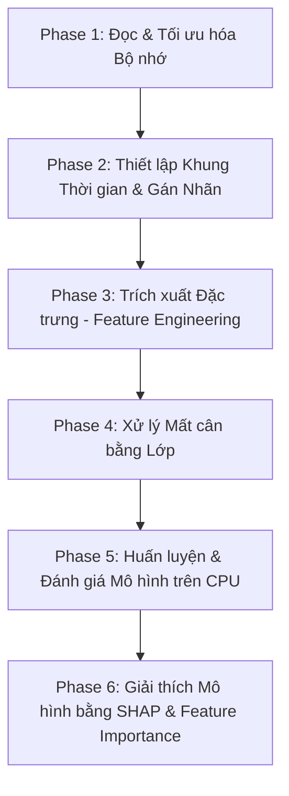

# MASTER DEVELOPMENT BLUEPRINT - CUSTOMER CHURN PREDICTION (SETTING C)

> Tài liệu thiết kế chi tiết (Low-Level Design - LLD) cho hệ thống dự đoán khả năng rời bỏ (churn) của khách hàng trên tập dữ liệu Olist Brazilian E-Commerce, tối ưu hóa cho cấu hình phần cứng hạn chế (RAM 8GB, CPU-only).

## 1. PROBLEM PROFILE (HỒ SƠ BÀI TOÁN)

- **Business Goal:** Dự đoán khả năng rời bỏ (churn) của khách hàng để doanh nghiệp có thể đưa ra các chương trình tiếp thị cá nhân hóa, chăm sóc khách hàng kịp thời nhằm tối đa hóa tỷ lệ giữ chân (customer retention).
- **Technical Objective:** Xây dựng mô hình phân loại nhị phân (Binary Classification) để dự đoán xác suất churn của từng khách hàng.
  - **Định nghĩa Churn:** Khách hàng được coi là churn nếu **sau 90 ngày kể từ mốc thời điểm đánh giá (Cutoff Date $T$) không phát sinh bất kỳ đơn hàng mới nào**.
  - **Explainability:** Giải thích được kết quả dự báo toàn cục (global) và cục bộ (local) dựa trên đặc trưng hành vi của khách hàng từ dữ liệu lịch sử.
- **Evaluation Metrics (Chỉ số đánh giá định lượng):**
  1. **ROC-AUC (Receiver Operating Characteristic - Area Under Curve):** Đánh giá khả năng phân biệt lớp của mô hình (ranking performance).
  2. **Recall (Độ bao phủ):** Đo lường tỷ lệ phát hiện chính xác khách hàng thực sự churn (rất quan trọng trong kinh doanh, tránh bỏ sót khách hàng sắp rời bỏ).
  3. **F1-Score:** Trung bình điều hòa giữa Precision và Recall, giúp đánh giá mô hình cân bằng khi dữ liệu mất cân bằng lớp.

- **Resource Constraints (Ràng buộc phần cứng):**
  - RAM: 8 GB.
  - GPU: Không có (chỉ sử dụng CPU để huấn luyện và suy diễn).
  - Kích thước tập dữ liệu: ~99 MB raw data (9 bảng quan hệ). Bảng geolocation lớn nhất (~50MB, 1M rows) có nguy cơ gây tràn bộ nhớ (Out-Of-Memory - OOM) khi thực hiện join không tối ưu.

---

## 2. HIGH-LEVEL PIPELINE (QUY TRÌNH HỆ THỐNG)

Quy trình được thiết kế thành 6 Phase chính, tối ưu hóa tài nguyên RAM ở từng bước:



### Phase 1: Đọc Dữ liệu và Tối ưu hóa Bộ nhớ
- **Mục tiêu:** Load 9 bảng CSV từ dataset Olist, thực hiện nén dữ liệu (downcasting dtypes) và giải phóng RAM ngay lập tức.
- **Tối ưu hóa RAM:**
  - Downcast số nguyên (`int64` -> `int32`/`int16`) và số thực (`float64` -> `float32`).
  - Ép kiểu các cột phân loại có số lượng giá trị duy nhất ít (low-cardinality strings như `order_status`, `customer_state`, `payment_type`) thành kiểu `category` trong pandas.
  - Bảng `olist_geolocation_dataset.csv` chứa 1M dòng (~50MB) có nhiều tọa độ trùng mã zip. Thực hiện gom nhóm (Groupby + Mean) theo `zip_code_prefix` ngay trước khi join để giảm kích thước bảng xuống còn ~19,000 dòng.

### Phase 2: Thiết lập Khung Thời gian & Gán Nhãn Churn
- **Mục tiêu:** Xác định tập khách hàng active và gán nhãn churn dựa trên định nghĩa 90 ngày.
- **Thời gian bao phủ của dữ liệu:** Tháng 01/2016 đến Tháng 08/2018.
- **Cơ chế sliding/temporal window:**
  - Chọn mốc thời điểm đánh giá (Cutoff Date) $T$.
  - **Observation Window (Khung quan sát):** Khoảng thời gian trước $T$ (ví dụ: $[T - 180\text{ ngày}, T]$) dùng để tính toán các đặc trưng hành vi khách hàng.
  - **Prediction Window (Khung dự báo):** Khoảng thời gian sau $T$ (chính xác là $(T, T + 90\text{ ngày}]$) dùng để gán nhãn churn.
  - **Nhãn Churn ($Y$):**
    - $Y = 1$ (Churn): Khách hàng có mua hàng trong Observation Window nhưng không có đơn hàng nào trong Prediction Window.
    - $Y = 0$ (Active): Khách hàng có mua hàng trong Observation Window và tiếp tục mua ít nhất một đơn hàng trong Prediction Window.
- **Temporal Split để chống Leakage:**
  - Chọn $T_{train} =$ `2018-02-01` (Dữ liệu đặc trưng: trước 01/02/2018; Dữ liệu nhãn: 01/02/2018 - 02/05/2018).
  - Chọn $T_{test} =$ `2018-05-15` (Dữ liệu đặc trưng: trước 15/05/2018; Dữ liệu nhãn: 15/05/2018 - 15/08/2018, đảm bảo kết thúc trước tháng 08/2018).
  - Điều này giúp tránh rò rỉ thông tin thời gian giữa tập train và test.

### Phase 3: Trích xuất Đặc trưng (Feature Engineering)
- **RFM Features:** Recency (Số ngày từ đơn cuối cùng đến $T$), Frequency (Số đơn hàng trước $T$), Monetary (Tổng giá trị chi tiêu trước $T$).
- **Delivery Features:** Thời gian giao hàng thực tế (`order_delivered_customer_date` - `order_purchase_timestamp`), tỷ lệ giao hàng trễ so với dự kiến (`order_delivered_customer_date` - `order_estimated_delivery_date`), tỷ lệ đơn hàng bị hủy.
- **Payment Features:** Số kỳ trả góp trung bình (`payment_installments`), phân phối loại thanh toán (tỷ lệ thanh toán bằng `credit_card`, `boleto`, `voucher`, `debit_card`).
- **Satisfaction Features:** Điểm đánh giá trung bình từ `review_score` của khách hàng trong Observation Window.
- **Product Features:** Số lượng danh mục sản phẩm khác nhau đã mua (Category Diversity).

### Phase 4: Xử lý Mất cân bằng Lớp (Class Imbalance)
- Phân tích tỷ lệ phân phối lớp. Do hành vi mua lại trong TMĐT thường thấp, tỷ lệ churn sẽ rất cao (lớp 1 chiếm đa số hoặc ngược lại tùy thuộc vào cách lọc khách hàng tích cực).
- Sử dụng giải pháp tiết kiệm bộ nhớ: thay vì dùng SMOTE tạo thêm mẫu ảo làm tăng RAM, sử dụng cơ chế Cost-Sensitive Learning thông qua tham số `class_weight='balanced'` (Logistic Regression) hoặc `scale_pos_weight` (LightGBM, XGBoost).

### Phase 5: Huấn luyện & Đánh giá Mô hình trên CPU
- **Models:**
  1. **Baseline:** Logistic Regression (sau khi chuẩn hóa RobustScaler/StandardScaler).
  2. **LightGBM Classifier:** Mô hình gradient boosting tối ưu hóa tốc độ và bộ nhớ vượt trội, phù hợp cho CPU-only.
  3. **XGBoost Classifier:** Sử dụng tham số `tree_method='hist'` để tăng tốc độ huấn luyện trên CPU và tiết kiệm RAM.
- **Đánh giá:** Tính toán và xuất báo cáo ROC-AUC, F1-Score, Recall trên tập test.

### Phase 6: Giải thích Mô hình (Explainability)
- Sử dụng **Feature Importance** (dựa trên Gain và Split của LightGBM/XGBoost) để phân tích tầm quan trọng toàn cục của các đặc trưng.
- Sử dụng **SHAP (SHapley Additive exPlanations)** để giải thích chi tiết tác động của từng đặc trưng đến xác suất churn của một khách hàng cụ thể.
- **Tối ưu hóa RAM cho SHAP:** Chỉ sử dụng một mẫu nhỏ (background dataset khoảng 100-200 khách hàng từ tập train) để khởi tạo `shap.TreeExplainer` nhằm tránh việc CPU chạy quá tải hoặc tràn bộ nhớ.

---

## 3. EXECUTION BLUEPRINT (BẢN THIẾT KẾ THI CÔNG CHI TIẾT)

### PART A: Codebase Structure (Cấu trúc thư mục dự án)

```text
project_root/
│
├── main.py                     # Script chạy chính điều phối toàn bộ pipeline
├── config.py                   # Cấu hình đường dẫn, tham số mô hình, cutoff dates
├── requirements.txt            # Thư viện phụ thuộc
│
├── data_loader/                # Quản lý đọc dữ liệu và tối ưu RAM
│   ├── __init__.py
│   ├── reader.py               # Đọc và tối ưu kiểu dữ liệu CSV
│   └── aggregator.py           # Gom nhóm bảng lớn (geolocation) trước khi join
│
├── features/                   # Xây dựng các đặc trưng hành vi
│   ├── __init__.py
│   ├── labeler.py              # Xác định khách hàng active và gán nhãn Churn
│   ├── rfm.py                  # Tính toán đặc trưng RFM
│   ├── transaction.py          # Tính toán các đặc trưng giao hàng, thanh toán, đánh giá
│   └── merger.py               # Tổng hợp tất cả các nhóm đặc trưng thành bảng master
│
├── modeling/                   # Huấn luyện và đánh giá mô hình
│   ├── __init__.py
│   ├── trainer.py              # Huấn luyện Logistic Regression, LightGBM, XGBoost
│   └── evaluator.py            # Đánh giá ROC-AUC, F1, Recall
│
└── explainability/             # Giải thích mô hình
    ├── __init__.py
    ├── global_explain.py       # Tính toán và vẽ Feature Importance
    └── shap_explain.py         # Khởi tạo TreeExplainer và vẽ SHAP Summary/Force plots
```

---

### PART B: Function-File Mapping (Chi tiết hóa hàm trong mã nguồn)

Dưới đây là thiết kế chi tiết cho từng hàm trong các file nguồn, kèm cấu trúc tham số đầu vào/đầu ra và logic thực thi chi tiết để lập trình viên có thể viết mã trực tiếp.

#### Folder: `data_loader/`

##### File: `data_loader/reader.py`
```python
import pandas as pd
import gc
from typing import Dict

def load_and_optimize_csv(file_path: str, table_name: str) -> pd.DataFrame:
    """
    Responsibility:
        Đọc file CSV của Olist với encoding phù hợp (mặc định UTF-8 hoặc Latin-1 nếu lỗi),
        thực hiện ép kiểu dữ liệu ngay lập tức để tiết kiệm bộ nhớ RAM.
    
    Task Execution:
        1. Đọc file CSV bằng pd.read_csv.
        2. Dựa vào table_name, tự động ép kiểu các cột datetime (ví dụ: các cột chứa '_timestamp', '_date', '_at').
        3. Tối ưu kiểu dữ liệu số:
           - Chuyển float64 sang float32.
           - Chuyển int64 sang int32 hoặc int16 (tùy thuộc vào max_value của cột).
        4. Tối ưu kiểu phân loại:
           - Chuyển các cột string có số lượng giá trị duy nhất ít (như order_status, payment_type, state, city) thành category.
        5. Gọi gc.collect() để thu hồi bộ nhớ trống.
        6. Trả về DataFrame đã tối ưu.
    """
    pass
```

##### File: `data_loader/aggregator.py`
```python
import pandas as pd

def aggregate_geolocation(geo_df: pd.DataFrame) -> pd.DataFrame:
    """
    Responsibility:
        Gom nhóm bảng geolocation lớn (1M dòng, ~50MB) theo zip_code_prefix để tránh làm tràn bộ nhớ
        khi thực hiện join với bảng customer và seller.
        
    Task Execution:
        1. Groupby geolocation_df theo cột `geolocation_zip_code_prefix`.
        2. Tính giá trị trung bình (mean) cho `geolocation_lat` và `geolocation_lng` để làm đại diện.
        3. Chọn ngẫu nhiên hoặc lấy giá trị phổ biến nhất cho `geolocation_city` và `geolocation_state` trong mỗi zip code.
        4. Trả về DataFrame geolocation thu gọn (chỉ còn khoảng ~19k dòng duy nhất).
    """
    pass
```

---

#### Folder: `features/`

##### File: `features/labeler.py`
```python
import pandas as pd
from typing import Tuple

def generate_customer_churn_labels(
    orders_df: pd.DataFrame, 
    customers_df: pd.DataFrame, 
    cutoff_date: pd.Timestamp, 
    observation_days: int = 180, 
    prediction_days: int = 90
) -> Tuple[pd.DataFrame, pd.DataFrame]:
    """
    Responsibility:
        Xác định danh sách khách hàng hoạt động (Active) trong Observation Window và gán nhãn Churn (0/1)
        dựa trên sự xuất hiện của đơn hàng trong Prediction Window.
        
    Task Execution:
        1. Join orders_df với customers_df theo `customer_id` để lấy `customer_unique_id`.
        2. Xác định Observation Window: [cutoff_date - observation_days, cutoff_date].
        3. Xác định Prediction Window: (cutoff_date, cutoff_date + prediction_days].
        4. Lọc tất cả các đơn hàng thuộc Observation Window. Những khách hàng có ít nhất 1 đơn hàng trong khoảng này
           sẽ được giữ lại làm tập mẫu nghiên cứu (Active Customers).
        5. Lọc tất cả các đơn hàng thuộc Prediction Window.
        6. Gán nhãn:
           - Churn (1): Nếu customer_unique_id có trong tập Active nhưng KHÔNG có đơn hàng nào trong Prediction Window.
           - Active (0): Nếu customer_unique_id có trong tập Active và CÓ ít nhất 1 đơn hàng trong Prediction Window.
        7. Trả về:
           - df_labels: DataFrame chứa [customer_unique_id, label (0 hoặc 1)]
           - df_obs_orders: DataFrame chứa các đơn hàng trong Observation Window của các khách hàng này để tính features.
    """
    pass
```

##### File: `features/rfm.py`
```python
import pandas as pd

def compute_rfm_features(obs_orders_df: pd.DataFrame, items_df: pd.DataFrame, cutoff_date: pd.Timestamp) -> pd.DataFrame:
    """
    Responsibility:
        Tính toán các đặc trưng RFM truyền thống từ dữ liệu lịch sử mua hàng của khách hàng trong Observation Window.
        
    Task Execution:
        1. Kết nối obs_orders_df với items_df qua `order_id` để lấy thông tin giá sản phẩm (`price`).
        2. Nhóm dữ liệu theo `customer_unique_id`.
        3. Tính toán:
           - Recency (R): Số ngày từ ngày đặt hàng cuối cùng (`order_purchase_timestamp`) đến mốc `cutoff_date`.
           - Frequency (F): Tổng số đơn hàng duy nhất (`order_id`) mà khách hàng đã thực hiện.
           - Monetary (M): Tổng giá trị chi tiêu (tổng `price` của toàn bộ các sản phẩm đã mua).
           - Average Monetary: Trung bình giá trị của mỗi đơn hàng.
        4. Trả về DataFrame chứa [customer_unique_id, recency, frequency, monetary, avg_monetary].
    """
    pass
```

##### File: `features/transaction.py`
```python
import pandas as pd

def compute_transaction_behavioral_features(
    obs_orders_df: pd.DataFrame, 
    payments_df: pd.DataFrame, 
    reviews_df: pd.DataFrame, 
    items_df: pd.DataFrame
) -> pd.DataFrame:
    """
    Responsibility:
        Tính toán các đặc trưng nâng cao liên quan đến hành vi giao dịch, thanh toán, mức độ hài lòng và thuộc tính sản phẩm.
        
    Task Execution:
        1. Tính toán Đặc trưng Giao hàng (Delivery Performance):
           - Tính khoảng cách thời gian giao hàng thực tế: `order_delivered_customer_date` - `order_purchase_timestamp`.
           - Tính số ngày giao hàng trễ: `order_delivered_customer_date` - `order_estimated_delivery_date`.
           - Gán cờ trễ hạn: `is_late = 1` nếu giao trễ, `0` nếu đúng hạn.
           - Groupby theo `customer_unique_id` để lấy: trung bình số ngày giao hàng thực tế, tỷ lệ đơn hàng bị giao trễ.
        2. Tính toán Đặc trưng Thanh toán (Payment Metrics):
           - Groupby payments_df theo `order_id` để tính số kỳ trả góp trung bình (`payment_installments`) và tỷ lệ các phương thức thanh toán (`credit_card`, `boleto`, `voucher`, etc.).
           - Map thông tin này sang `customer_unique_id`.
        3. Tính toán Đánh giá của Khách hàng (Satisfaction Metrics):
           - Groupby reviews_df theo `customer_unique_id` (sau khi join qua orders) để tính `avg_review_score`.
        4. Tính toán Đặc trưng Phân loại Sản phẩm (Category Diversity):
           - Join items_df với products_df để lấy `product_category_name`.
           - Tính số lượng danh mục sản phẩm duy nhất khách hàng đã mua.
        5. Tổng hợp các thông tin trên thành một DataFrame theo `customer_unique_id` và trả về.
    """
    pass
```

##### File: `features/merger.py`
```python
import pandas as pd

def merge_all_features(
    labels_df: pd.DataFrame, 
    rfm_df: pd.DataFrame, 
    behavioral_df: pd.DataFrame
) -> pd.DataFrame:
    """
    Responsibility:
        Ghép nhãn và tất cả các đặc trưng đã tính toán thành một bảng master duy nhất cho mô hình học máy.
        
    Task Execution:
        1. Thực hiện left join labels_df với rfm_df theo `customer_unique_id`.
        2. Tiếp tục left join với behavioral_df theo `customer_unique_id`.
        3. Xử lý các giá trị khuyết (Missing Values):
           - Điền `0` cho các đặc trưng tần suất, giá trị giao dịch nếu thiếu.
           - Điền giá trị trung vị (median) cho các cột như `avg_review_score` hoặc thời gian giao hàng.
           - Tạo thêm các cờ báo hiệu giá trị bị thiếu nếu tỷ lệ thiếu lớn (ví dụ: `is_review_missing`).
        4. Trả về bảng Master Feature DataFrame hoàn chỉnh.
    """
    pass
```

---

#### Folder: `modeling/`

##### File: `modeling/trainer.py`
```python
import pandas as pd
from typing import Dict, Any
from sklearn.linear_model import LogisticRegression
from sklearn.preprocessing import StandardScaler
from sklearn.pipeline import Pipeline
import lightgbm as lgb
import xgboost as xgb

def train_all_models(X_train: pd.DataFrame, y_train: pd.Series, scale_pos_weight: float) -> Dict[str, Any]:
    """
    Responsibility:
        Huấn luyện đồng thời 3 mô hình (Logistic Regression baseline, LightGBM, XGBoost) trên CPU,
        áp dụng các cơ chế kiểm soát tài nguyên để tránh tràn bộ nhớ RAM 8GB.
        
    Task Execution:
        1. Logistic Regression (Baseline):
           - Xây dựng Pipeline gồm `StandardScaler` và `LogisticRegression`.
           - Sử dụng tham số `class_weight='balanced'` để tự động xử lý mất cân bằng lớp.
           - Huấn luyện trên CPU.
        2. LightGBM:
           - Khởi tạo `LGBMClassifier` với:
             * `n_estimators=100` (giới hạn để tiết kiệm tài nguyên).
             * `num_leaves=31` (tránh overfitting và tiết kiệm RAM).
             * `scale_pos_weight=scale_pos_weight` (xử lý mất cân bằng lớp).
             * `n_jobs=-1` (tận dụng tối đa lõi CPU).
           - Huấn luyện mô hình.
        3. XGBoost:
           - Khởi tạo `XGBClassifier` với:
             * `n_estimators=100`
             * `max_depth=6`
             * `tree_method='hist'` (BẮT BUỘC: thuật toán chia bin histogram giúp tiết kiệm RAM và CPU tối đa).
             * `scale_pos_weight=scale_pos_weight`
             * `n_jobs=-1`
           - Huấn luyện mô hình.
        4. Trả về dict chứa 3 mô hình đã được huấn luyện thành công.
    """
    pass
```

##### File: `modeling/evaluator.py`
```python
import pandas as pd
from typing import Dict, Any

def evaluate_models(models: Dict[str, Any], X_test: pd.DataFrame, y_test: pd.Series) -> pd.DataFrame:
    """
    Responsibility:
        Đánh giá hiệu năng của các mô hình trên tập kiểm thử (test set) bằng các chỉ số định lượng rõ ràng.
        
    Task Execution:
        1. Khởi tạo danh sách kết quả rỗng.
        2. Duyệt qua từng mô hình trong dict `models`:
           - Dự đoán nhãn lớp (`y_pred`) bằng threshold mặc định 0.5.
           - Dự đoán xác suất churn (`y_prob`).
           - Tính toán chỉ số ROC-AUC bằng `sklearn.metrics.roc_auc_score`.
           - Tính toán Recall bằng `sklearn.metrics.recall_score`.
           - Tính toán F1-Score bằng `sklearn.metrics.f1_score`.
        3. Gom các kết quả thành một bảng so sánh (DataFrame).
        4. Trả về bảng kết quả so sánh.
    """
    pass
```

---

#### Folder: `explainability/`

##### File: `explainability/global_explain.py`
```python
import pandas as pd
import matplotlib.pyplot as plt
from typing import Any

def plot_and_save_feature_importance(model: Any, feature_names: list, output_path: str) -> None:
    """
    Responsibility:
        Trích xuất và vẽ biểu đồ tầm quan trọng toàn cục (Global Feature Importance) của mô hình tốt nhất.
        
    Task Execution:
        1. Kiểm tra loại mô hình:
           - Nếu là LightGBM/XGBoost: sử dụng thuộc tính `feature_importances_`.
           - Nếu là Logistic Regression: sử dụng trị tuyệt đối của hệ số `coef_[0]`.
        2. Tạo DataFrame lưu thông tin đặc trưng và điểm quan trọng tương ứng, sắp xếp giảm dần.
        3. Lưu danh sách này ra file CSV phục vụ kiểm tra chi tiết.
        4. Vẽ biểu đồ cột ngang (Horizontal Bar Chart) hiển thị Top 15 đặc trưng quan trọng nhất bằng matplotlib.
        5. Lưu biểu đồ dưới dạng file PNG vào `output_path`.
    """
    pass
```

##### File: `explainability/shap_explain.py`
```python
import pandas as pd
import shap
import matplotlib.pyplot as plt
from typing import Any

def explain_predictions_with_shap(
    model: Any, 
    X_train: pd.DataFrame, 
    X_test: pd.DataFrame, 
    summary_plot_path: str
) -> None:
    """
    Responsibility:
        Sử dụng thư viện SHAP để giải thích tác động của các đặc trưng tới quyết định dự đoán của mô hình,
        tối ưu hóa bộ nhớ cho laptop RAM 8GB.
        
    Task Execution:
        1. Tối ưu hóa RAM:
           - Rút trích một tập nền (background dataset) ngẫu nhiên khoảng 100-200 mẫu từ X_train.
           - Điều này cực kỳ quan trọng vì nếu truyền toàn bộ X_train vào TreeExplainer trên CPU, 
             máy tính 8GB RAM sẽ bị treo hoặc tràn bộ nhớ.
        2. Khởi tạo `shap.TreeExplainer(model, data=background_data)`.
        3. Tính toán SHAP values trên tập test (chỉ lấy khoảng 500-1000 mẫu ngẫu nhiên từ X_test để tính nhanh trên CPU).
        4. Vẽ SHAP Summary Plot (Beeswarm plot) để hiển thị chiều hướng ảnh hưởng của các đặc trưng toàn cục.
        5. Lưu Summary Plot dưới dạng file ảnh PNG tại `summary_plot_path`.
    """
    pass
```

---

### PART D: Dependency Graph & Execution Flow

```text
[data_loader/reader.py] 
       │ (Load CSVs & Optimize Types)
       ▼
[data_loader/aggregator.py] 
       │ (Aggregate geolocation to zip_code level)
       ▼
[features/labeler.py] 
       │ (Set Cutoff Dates T_train / T_test, label churn, filter active customers)
       ▼
[features/rfm.py] & [features/transaction.py]
       │ (Extract RFM, delivery delay, satisfaction reviews, payments)
       ▼
[features/merger.py] 
       │ (Create Master Training & Testing Matrices)
       ▼
[modeling/trainer.py] 
       │ (Train baseline LR, LightGBM, CPU-optimized XGBoost hist)
       ▼
[modeling/evaluator.py] 
       │ (Compute ROC-AUC, Recall, F1 on temporal test set)
       ▼
[explainability/global_explain.py] & [explainability/shap_explain.py]
       │ (Global feature importance & CPU-safe background-sampled SHAP explanations)
```

---

## 4. CHƯƠNG TRÌNH KHẮC PHỤC GIỚI HẠN PHẦN CỨNG (RAM 8GB & CPU-ONLY)

Để chạy trơn tru bài toán này trên một laptop cá nhân 8GB RAM mà không bị crash, thiết kế áp dụng nghiêm ngặt các nguyên lý quản lý bộ nhớ sau:

| Thách thức | Giải pháp thiết kế | Vị trí triển khai |
| :--- | :--- | :--- |
| **Bảng Geolocation quá lớn (1M dòng, ~50MB)** | Gom nhóm (Groupby + Mean) theo zip code trước khi join. Giảm số lượng dòng xuống 50 lần. | `data_loader/aggregator.py` |
| **Tràn RAM do kiểu dữ liệu mặc định (float64, int64)** | Thực hiện downcasting sang float32 và int32/int16 ngay khi load bảng. Chuyển string phân loại có lực lượng thấp thành kiểu category. | `data_loader/reader.py` |
| **Tràn RAM khi join nhiều bảng lớn** | Sử dụng garbage collection chủ động (`import gc; gc.collect()`) và lệnh xóa biến thừa (`del df_temp`) sau khi hoàn thành mỗi bước join hoặc tính toán feature. | Xuyên suốt các file trích xuất feature |
| **Huấn luyện XGBoost tốn bộ nhớ và CPU** | Sử dụng tham số `tree_method='hist'`. Thuật toán này băm dữ liệu liên tục thành các bin số lượng cố định, giảm thời gian tính toán phân ngưỡng chia nhánh từ $O(N \log N)$ xuống $O(N)$ và giảm 80% bộ nhớ. | `modeling/trainer.py` |
| **Tính SHAP values trên CPU cực kỳ chậm và tốn RAM** | Rút trích mẫu ngẫu nhiên (100-200 mẫu) làm background dataset cho TreeExplainer thay vì sử dụng toàn bộ tập train. Lọc 500 dòng test để giải thích cục bộ. | `explainability/shap_explain.py` |

---

## 5. KẾ HOẠCH ĐÁNH GIÁ VÀ NGHIỆM THU (VERIFICATION PLAN)

### Kiểm thử Tự động (Automated Scripts)
- Chạy script kiểm tra chất lượng dữ liệu và kiểm tra rò rỉ bộ nhớ bằng thư viện `psutil` để log dung lượng RAM tiêu thụ ở cuối mỗi phase.
- Chạy script so sánh các chỉ số ROC-AUC, F1, Recall giữa 3 mô hình.

### Đánh giá Mô hình trên Tập Test Temporal
Mô hình sẽ được coi là đạt yêu cầu nếu đạt các tiêu chí tối thiểu sau trên tập kiểm thử độc lập về mặt thời gian ($T_{test}$):
- **ROC-AUC > 0.72:** Khả năng xếp hạng rủi ro churn ở mức tốt.
- **Recall > 0.65:** Tìm ra được ít nhất 65% số khách hàng thực sự sẽ rời bỏ hệ thống trong 90 ngày tới.
- **F1-Score > 0.55:** Cân bằng tốt giữa Precision và Recall trên tập dữ liệu mất cân bằng.

### Khả năng Giải thích (Explainability Target)
- Xuất được biểu đồ top features ảnh hưởng nhiều nhất đến churn. Kỳ vọng thực tế dựa trên phân tích đặc trưng của Olist:
  - **Recency** (Số ngày từ lần mua cuối) là feature quan trọng nhất: Khách hàng càng lâu chưa mua hàng thì xác suất churn càng tiến gần về 1.
  - **Review Score** (Độ hài lòng): Khách hàng đánh giá 1-2 sao có tỷ lệ churn cao vượt trội so với nhóm đánh giá 5 sao.
  - **Delivery Delay** (Thời gian giao trễ): Đơn giao trễ làm gia tăng trải nghiệm tệ, dẫn đến churn.
- Xuất thành công file HTML/PNG chứa SHAP summary và force plot giải thích lý do cho nhóm top 10 khách hàng có nguy cơ churn cao nhất.
