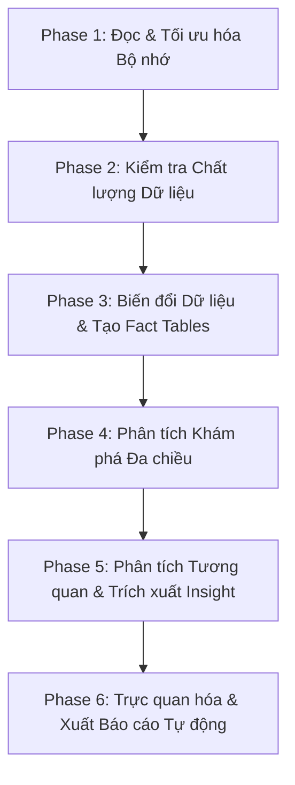

# MASTER DEVELOPMENT BLUEPRINT - OLIST DATA ANALYSIS PIPELINE (SETTING C)

> Tài liệu thiết kế chi tiết (Low-Level Design - LLD) cho hệ thống phân tích khám phá dữ liệu (EDA), phân tích tỷ lệ giữ chân khách hàng (customer retention), thời gian giao hàng chậm trễ (delivery performance), và xu hướng doanh thu (revenue trends) trên tập dữ liệu Olist Brazilian E-Commerce, tối ưu hóa cho cấu hình phần cứng hạn chế (RAM 8GB, CPU-only).

---

## 1. PROBLEM PROFILE (HỒ SƠ BÀI TOÁN)

- **Business Goal:** Phân tích các yếu tố vận hành và hành vi mua sắm từ bộ dữ liệu Olist để rút ra các insight kinh doanh cốt lõi (tỷ lệ mua lại, chất lượng dịch vụ giao hàng, đóng góp doanh thu theo địa lý/danh mục) giúp doanh nghiệp tối ưu hóa hoạt động thương mại điện tử.
- **Technical Objective:** Xây dựng một pipeline phân tích dữ liệu tự động, thực hiện làm sạch dữ liệu, xây dựng các Fact Tables chuẩn hóa, chạy phân tích thống kê đa chiều, trực quan hóa kết quả và tự động xuất báo cáo hoàn chỉnh dưới dạng Jupyter Notebook.
- **Chỉ số Phân tích Chính (Core Analytical Metrics):**
  1. **Customer Retention:**
     - *Repeat Purchase Rate (RPR):* Tỷ lệ khách hàng mua hàng từ 2 lần trở lên dựa trên `customer_unique_id`.
     - *Cohort Retention Rate:* Tỷ lệ giữ chân khách hàng theo nhóm tháng mua hàng đầu tiên (Cohort) tại các mốc thời gian (Month 1, Month 3, Month 6).
  2. **Delivery Performance:**
     - *Late Delivery Rate:* Tỷ lệ đơn hàng giao trễ thực tế so với thời gian dự kiến (`order_delivered_customer_date` > `order_estimated_delivery_date`).
     - *Delivery Gap & Days Late:* Khoảng thời gian giao hàng thực tế và số ngày trễ hạn (phân tích theo bang của khách hàng và theo tháng).
  3. **Revenue Trends:**
     - *Doanh thu theo thời gian:* Xu hướng doanh thu hàng tháng và tốc độ tăng trưởng doanh thu so với tháng trước.
     - *Phân đoạn doanh thu:* Đóng góp doanh thu theo bang (State), danh mục sản phẩm (Category), và phương thức thanh toán (Payment Type).
  4. **Cross-Correlation Analysis:**
     - Mối liên hệ giữa trải nghiệm giao hàng của đơn đầu tiên (đúng hạn vs giao trễ) với tỷ lệ mua lại (retention).
     - Mối tương quan giữa mức độ trễ hạn (đúng hạn, trễ nhẹ 1-7 ngày, trễ nặng >7 ngày) với điểm đánh giá (`review_score`).

- **Resource Constraints (Ràng buộc phần cứng):**
  - **RAM:** 8 GB.
  - **GPU:** Không có (CPU-only).
  - **Kích thước tập dữ liệu:** ~99 MB raw data (9 bảng CSV). Bảng geolocation lớn nhất (~50MB, 1M dòng) dễ gây lỗi tràn bộ nhớ (Out-Of-Memory - OOM) trên RAM 8GB nếu không thực hiện gom nhóm tối ưu trước khi thực hiện các liên kết dữ liệu (join/merge).

---

## 2. HIGH-LEVEL PIPELINE (QUY TRÌNH HỆ THỐNG)

Quy trình được thiết kế thành 6 Phase để đảm bảo tính module hóa cao và tối ưu bộ nhớ RAM ở từng công đoạn:



### Phase 1: Đọc Dữ liệu và Tối ưu hóa Bộ nhớ
- **Mục tiêu:** Load 9 bảng CSV từ dataset Olist, thực hiện nén dữ liệu ngay lập tức (downcasting numerical dtypes) và giải phóng RAM bằng Garbage Collection.
- **Tối ưu hóa RAM:**
  - Downcast số nguyên (`int64` -> `int32`/`int16`) và số thực (`float64` -> `float32`).
  - Chuyển đổi các cột string có cardinality thấp (`order_status`, `customer_state`, `payment_type`) thành kiểu `category` trong pandas.
  - Bảng `olist_geolocation_dataset.csv` chứa 1M dòng (~50MB). Thực hiện gom nhóm (Groupby + Mean) theo `zip_code_prefix` ngay trước khi join để giảm kích thước bảng xuống còn ~19,000 dòng duy nhất, triệt tiêu nguy cơ OOM.

### Phase 2: Kiểm tra Chất lượng Dữ liệu (Data Quality Check)
- **Mục tiêu:** Kiểm tra và loại bỏ các bản ghi không hợp lệ hoặc thiếu thông tin quan trọng.
- **Quy tắc làm sạch:**
  - Kiểm tra và báo cáo tỷ lệ khuyết thiếu (NULL) trong các cột mốc thời gian quan trọng (`order_approved_at`, `order_delivered_carrier_date`, `order_delivered_customer_date`).
  - Lọc và chỉ giữ các đơn hàng có trạng thái `delivered` và có đủ thông tin `order_delivered_customer_date` cùng `order_estimated_delivery_date` cho phân tích thời gian giao hàng.
  - Phát hiện giá trị bất thường (âm hoặc NULL) trong các cột tiền tệ (`price`, `freight_value`, `payment_value`).

### Phase 3: Biến đổi Dữ liệu và Xây dựng Fact Tables
- **Mục tiêu:** Xây dựng 3 bảng Fact chuẩn hóa để phục vụ trực tiếp cho các tác vụ phân tích, tránh việc join lặp đi lặp lại nhiều lần gây tốn RAM:
  1. `order_fact`: Chứa thông tin tổng hợp của từng đơn hàng (1 dòng/`order_id`), gồm tổng tiền thanh toán, thời gian giao hàng, khoảng cách ngày giao hàng thực tế vs dự kiến, cờ giao trễ (`is_late`), số ngày trễ (`days_late`).
  2. `order_item_fact`: Chứa thông tin chi tiết từng sản phẩm trong đơn hàng (1 dòng/`order_id` + `product_id`), đi kèm tên danh mục sản phẩm tiếng Anh.
  3. `customer_month_fact`: Tổng hợp theo `customer_unique_id`, ghi nhận tháng mua hàng đầu tiên (Cohort Month), tổng số đơn hàng đã mua, và trạng thái khách hàng quay lại (Repeat Customer).

### Phase 4: Phân tích Khám phá Đa chiều (EDA)
- **Mục tiêu:** Thực hiện các phép tính toán thống kê chi tiết:
  - Tính toán tỷ lệ mua lặp lại (RPR) toàn hệ thống và vẽ ma trận Cohort Retention.
  - Tính toán tỷ lệ trễ hạn giao hàng và phân tích theo bang của khách hàng cùng phân phối theo tháng.
  - Phân tích xu hướng doanh thu hàng tháng (kèm tốc độ tăng trưởng MoM), tỷ lệ đóng góp của Top 10 danh mục sản phẩm bán chạy nhất, và phân bổ doanh thu theo địa lý.

### Phase 5: Phân tích Tương quan & Trích xuất Insight
- **Mục tiêu:** Liên kết trải nghiệm khách hàng với hành vi loyalty của họ:
  - So sánh tỷ lệ mua lại giữa nhóm khách hàng có đơn hàng đầu tiên được giao đúng hạn vs giao trễ.
  - Phân tích phân phối điểm số đánh giá (`review_score`) theo 3 mức độ giao hàng: đúng hạn (`on_time`), giao trễ nhẹ từ 1-7 ngày (`late_light`), giao trễ nặng trên 7 ngày (`late_heavy`).
  - *Nguyên tắc diễn giải:* Chỉ kết luận dạng "tương quan", tuyệt đối không dùng ngôn ngữ khẳng định "quan hệ nhân quả" (causality) khi chưa có kiểm thử A/B.

### Phase 6: Trực quan hóa & Xuất Báo cáo Tự động
- **Mục tiêu:** Vẽ các biểu đồ trực quan (line chart doanh thu/giao trễ, cohort retention heatmap, bar chart danh mục/khu vực) và lưu thành file PNG.
- **Xuất báo cáo:** Tự động sinh file Jupyter Notebook (`final_report.ipynb`) chứa đầy đủ các phân tích trực quan hóa, bảng thống kê và đính kèm danh sách các insight kinh doanh chính cùng metadata của phiên chạy để đảm bảo tính tái lập (reproducibility).

---

## 3. EXECUTION BLUEPRINT (BẢN THIẾT KẾ THI CÔNG CHI TIẾT)

### PART A: Codebase Structure (Cấu trúc thư mục dự án)

```text
project_root/
│
├── main.py                     # Script điều phối toàn bộ pipeline phân tích
├── config.py                   # Cấu hình đường dẫn dữ liệu, các hằng số và thư mục đầu ra
├── requirements.txt            # Danh sách thư viện cần thiết (pandas, numpy, matplotlib, seaborn, nbformat, psutil)
│
├── data_loader/                # Module tải dữ liệu và tối ưu hóa bộ nhớ
│   ├── __init__.py
│   ├── reader.py               # Hàm đọc CSV và tối ưu kiểu dữ liệu
│   └── aggregator.py           # Gom nhóm dữ liệu địa lý geolocation
│
├── quality/                    # Module kiểm tra chất lượng dữ liệu
│   ├── __init__.py
│   └── validator.py            # Kiểm tra lỗi thời gian, dữ liệu khuyết và tiền tệ bất thường
│
├── transformation/             # Module biến đổi dữ liệu sang Fact Tables
│   ├── __init__.py
│   └── fact_builder.py         # Hàm xây dựng order_fact, order_item_fact, customer_month_fact
│
├── analysis/                   # Module thực hiện tính toán thống kê
│   ├── __init__.py
│   ├── retention.py            # Tính toán tỷ lệ mua lại và cohort retention
│   ├── delivery.py             # Tính tỷ lệ giao trễ theo bang và theo tháng
│   ├── revenue.py              # Tính doanh thu theo thời gian, danh mục, khu vực, thanh toán
│   └── correlator.py           # Phân tích tương quan giữa giao hàng và retention/review score
│
└── reporting/                  # Module trực quan hóa và kết xuất báo cáo
    ├── __init__.py
    ├── visualizer.py           # Hàm vẽ biểu đồ xu hướng, heatmap và tương quan
    └── notebook_generator.py   # Hàm sinh tự động báo cáo Jupyter Notebook (.ipynb)
```

---

### PART B: Function-File Mapping (Chi tiết hóa hàm trong mã nguồn)

Dưới đây là đặc tả chi tiết của từng hàm trong các file nguồn, làm cơ sở lập trình trực tiếp cho coding agent:

#### 1. Folder: `data_loader/`

##### File: `data_loader/reader.py`
```python
import pandas as pd
import os
import gc

def load_and_optimize_csv(file_path: str, table_name: str) -> pd.DataFrame:
    """
    Responsibility:
        Đọc file CSV với mã hóa UTF-8 (hoặc fallback sang latin-1 nếu lỗi),
        thực hiện ép kiểu dữ liệu ngay lập tức để tiết kiệm tối đa RAM.
    
    Task Execution:
        1. Đọc file CSV bằng pd.read_csv.
        2. Dựa vào table_name, tự động parse các cột có hậu tố '_timestamp', '_date', '_at' thành kiểu datetime.
        3. Tối ưu hóa các cột dạng số:
           - Chuyển float64 -> float32.
           - Chuyển int64 -> int32 hoặc int16 dựa vào giá trị lớn nhất trong cột.
        4. Tối ưu hóa các cột dạng chuỗi phân loại (low-cardinality strings) như:
           'order_status', 'customer_state', 'seller_state', 'payment_type' thành kiểu 'category'.
        5. Gọi gc.collect() để thu hồi bộ nhớ.
        6. Trả về DataFrame đã tối ưu hóa.
    """
    pass
```

##### File: `data_loader/aggregator.py`
```python
import pandas as pd

def aggregate_geolocation(geo_df: pd.DataFrame) -> pd.DataFrame:
    """
    Responsibility:
        Gom nhóm bảng geolocation lớn (1M dòng, ~50MB) theo zip_code_prefix để tránh 
        gây OOM khi join với bảng customer và seller.
        
    Task Execution:
        1. Nhóm geo_df theo cột 'geolocation_zip_code_prefix'.
        2. Tính giá trị trung bình (mean) cho 'geolocation_lat' và 'geolocation_lng'.
        3. Lấy giá trị phổ biến nhất hoặc dòng đầu tiên cho 'geolocation_city' và 'geolocation_state' ứng với mỗi zip code.
        4. Trả về DataFrame geolocation thu gọn (chỉ còn khoảng ~19,000 dòng duy nhất).
    """
    pass
```

---

#### 2. Folder: `quality/`

##### File: `quality/validator.py`
```python
import pandas as pd
from typing import Dict, Any

def run_data_quality_checks(dfs: Dict[str, pd.DataFrame]) -> Dict[str, Any]:
    """
    Responsibility:
        Thực hiện kiểm tra tính toàn vẹn, logic thời gian và các bất thường trong dữ liệu tiền tệ.
        
    Task Execution:
        1. Kiểm tra logic thời gian trong bảng orders:
           - Phát hiện các đơn hàng có purchase_timestamp > delivered_customer_date.
        2. Báo cáo số lượng và tỷ lệ giá trị khuyết (NULL) ở các cột:
           'order_approved_at', 'order_delivered_carrier_date', 'order_delivered_customer_date'.
        3. Kiểm tra tính bất thường của dữ liệu tiền tệ:
           - Phát hiện giá trị âm (< 0) trong price (order_items) và payment_value (order_payments).
        4. Trích xuất danh sách các order_id hợp lệ cho phân tích giao hàng:
           - Trạng thái đơn hàng là 'delivered'.
           - Cả hai cột 'order_delivered_customer_date' và 'order_estimated_delivery_date' đều KHÔNG NULL.
        5. Trả về một dict chứa báo cáo chất lượng dữ liệu và danh sách order_id hợp lệ.
    """
    pass
```

---

#### 3. Folder: `transformation/`

##### File: `transformation/fact_builder.py`
```python
import pandas as pd
from typing import List

def build_order_fact(
    orders_df: pd.DataFrame, 
    payments_df: pd.DataFrame, 
    customers_df: pd.DataFrame, 
    valid_delivery_order_ids: List[str]
) -> pd.DataFrame:
    """
    Responsibility:
        Xây dựng bảng order_fact cấp đơn hàng (1 dòng/order_id), tích hợp thông tin 
        thanh toán, địa lý khách hàng và các chỉ số giao hàng chậm trễ.
        
    Task Execution:
        1. Nhóm payments_df theo 'order_id' và tính tổng 'payment_value' để có 'total_payment'.
        2. Lọc orders_df: chỉ giữ các dòng có order_id nằm trong valid_delivery_order_ids.
        3. Tính toán các chỉ số giao hàng:
           - 'delivery_gap' (timedelta) = order_delivered_customer_date - order_estimated_delivery_date.
           - 'is_late' (int) = 1 nếu delivery_gap > 0 ngày else 0.
           - 'days_late' (float) = delivery_gap.dt.total_seconds() / 86400 nếu is_late == 1 else 0.0.
           - 'actual_delivery_days' (float) = (order_delivered_customer_date - order_purchase_timestamp).dt.total_seconds() / 86400.
        4. Join thông tin orders đã tính toán với 'total_payment' và 'customers_df' (lấy customer_unique_id và customer_state).
        5. Đảm bảo 1 dòng/order_id duy nhất và không bị nhân bản dữ liệu.
        6. Trả về DataFrame order_fact.
    """
    pass

def build_order_item_fact(
    items_df: pd.DataFrame, 
    products_df: pd.DataFrame, 
    translation_df: pd.DataFrame
) -> pd.DataFrame:
    """
    Responsibility:
        Tạo bảng order_item_fact chuẩn hóa chứa thông tin sản phẩm và danh mục bằng tiếng Anh.
        
    Task Execution:
        1. Join products_df với translation_df theo 'product_category_name' để có danh mục tiếng Anh.
        2. Điền các danh mục bị thiếu hoặc không dịch được bằng nhãn 'Unknown'.
        3. Join kết quả trên với items_df để lấy thông tin chi tiết từng sản phẩm đặt mua.
        4. Trả về DataFrame order_item_fact chứa [order_id, product_id, price, freight_value, product_category_name_english].
    """
    pass

def build_customer_month_fact(order_fact_df: pd.DataFrame) -> pd.DataFrame:
    """
    Responsibility:
        Xây dựng bảng customer_month_fact tổng hợp theo khách hàng để phục vụ phân tích retention và cohort.
        
    Task Execution:
        1. Nhóm order_fact_df theo 'customer_unique_id'.
        2. Tính toán:
           - 'first_order_date' = min(order_purchase_timestamp).
           - 'cohort_month' = định dạng 'YYYY-MM' của first_order_date.
           - 'order_count' = số đơn hàng duy nhất đã đặt.
           - 'is_repeat_customer' = 1 nếu order_count >= 2 else 0.
           - 'total_spend' = tổng giá trị 'total_payment' của khách hàng đó.
        3. Trả về DataFrame customer_month_fact.
    """
    pass
```

---

#### 4. Folder: `analysis/`

##### File: `analysis/retention.py`
```python
import pandas as pd
from typing import Dict, Any

def analyze_customer_retention(
    customer_month_df: pd.DataFrame, 
    order_fact_df: pd.DataFrame
) -> Dict[str, Any]:
    """
    Responsibility:
        Thực hiện phân tích giữ chân khách hàng: Repeat Purchase Rate (RPR) và ma trận Cohort Retention.
        
    Task Execution:
        1. Tính toán Repeat Purchase Rate (RPR) = (số khách hàng có order_count >= 2) / (tổng số khách hàng duy nhất).
        2. Thực hiện Phân tích Cohort:
           - Xác định tháng của mỗi đơn hàng từ order_purchase_timestamp trong order_fact_df.
           - Join thông tin 'cohort_month' từ customer_month_df vào order_fact_df dựa trên customer_unique_id.
           - Tính 'periods_active' = Khoảng cách số tháng giữa ngày mua hàng của đơn hiện tại và cohort_month.
           - Lập bảng pivot table (hoặc groupby) theo cohort_month và periods_active để tính lượng khách hàng hoạt động.
           - Chuyển đổi số lượng khách hàng thành tỷ lệ (%) giữ chân tương ứng (Cohort Retention Matrix).
        3. Trả về một dict chứa RPR và Cohort Retention Matrix (DataFrame).
    """
    pass
```

##### File: `analysis/delivery.py`
```python
import pandas as pd
from typing import Dict, Any

def analyze_delivery_performance(order_fact_df: pd.DataFrame) -> Dict[str, Any]:
    """
    Responsibility:
        Phân tích hiệu suất giao hàng (tỷ lệ trễ hạn và số ngày trễ) theo bang khách hàng và xu hướng theo thời gian.
        
    Task Execution:
        1. Tính toán tỷ lệ giao trễ chung trên toàn hệ thống = (số đơn có is_late=1) / (tổng số đơn).
        2. Gom nhóm theo 'customer_state' để tính:
           - Tổng số đơn hàng được giao.
           - Tỷ lệ giao trễ ('late_rate').
           - Số ngày giao trễ trung vị ('median_days_late') và phân vị 90 ('p90_days_late') từ cột 'days_late'.
        3. Gom nhóm theo tháng đặt hàng (từ order_purchase_timestamp) để tính xu hướng tỷ lệ giao trễ theo thời gian.
        4. Trả về dict chứa kết quả phân tích theo bang và theo tháng.
    """
    pass
```

##### File: `analysis/revenue.py`
```python
import pandas as pd
from typing import Dict, Any

def analyze_revenue_trends(
    order_fact_df: pd.DataFrame, 
    item_fact_df: pd.DataFrame,
    payments_df: pd.DataFrame
) -> Dict[str, Any]:
    """
    Responsibility:
        Phân tích xu hướng doanh thu đa chiều: theo thời gian, bang khách hàng, danh mục sản phẩm và loại thanh toán.
        
    Task Execution:
        1. Tính toán xu hướng doanh thu hàng tháng:
           - Trích xuất tháng từ order_purchase_timestamp.
           - Tính tổng doanh thu (total_payment) hàng tháng.
           - Tính tỷ lệ tăng trưởng doanh thu theo tháng (MoM Growth Rate).
        2. Phân tích doanh thu theo danh mục sản phẩm:
           - Gom nhóm item_fact_df theo 'product_category_name_english'.
           - Tính tổng doanh thu (sum of price) và tỷ lệ đóng góp doanh thu của mỗi danh mục.
           - Sắp xếp giảm dần để lọc ra Top 10 danh mục.
        3. Phân tích doanh thu theo bang của khách hàng:
           - Gom nhóm order_fact_df theo 'customer_state'.
           - Tính tổng doanh thu và tỷ lệ đóng góp của từng bang.
        4. Phân tích doanh thu theo phương thức thanh toán:
           - Gom nhóm payments_df theo 'payment_type'.
           - Tính tổng giá trị thanh toán, số lượng đơn hàng sử dụng và số kỳ trả góp trung bình.
        5. Trả về dict chứa các DataFrame kết quả phân tích tương ứng.
    """
    pass
```

##### File: `analysis/correlator.py`
```python
import pandas as pd
from typing import Dict, Any

def correlate_delivery_and_customer_behavior(
    order_fact_df: pd.DataFrame, 
    customer_month_df: pd.DataFrame,
    reviews_df: pd.DataFrame
) -> Dict[str, Any]:
    """
    Responsibility:
        Phân tích mối tương quan giữa chất lượng giao hàng với hành vi giữ chân và đánh giá của khách hàng.
        
    Task Execution:
        1. Tương quan Giao hàng đơn đầu tiên vs Mua lại (Retention):
           - Xác định đơn hàng đầu tiên của từng khách hàng (dựa trên min purchase timestamp).
           - Lấy trạng thái giao hàng 'is_late' của đơn đầu tiên này.
           - Liên kết với trạng thái 'is_repeat_customer' của khách hàng đó từ customer_month_df.
           - Tính toán và so sánh Repeat Purchase Rate (RPR) giữa 2 nhóm: nhóm giao hàng đầu đúng hạn vs trễ hạn.
        2. Tương quan Trễ hạn vs Điểm đánh giá (Review Score):
           - Phân loại trạng thái trễ hạn đơn hàng thành 3 nhóm:
             * 'on_time': is_late == 0.
             * 'late_light': 0 < days_late <= 7 ngày.
             * 'late_heavy': days_late > 7 ngày.
           - Nhóm dữ liệu theo trạng thái trễ hạn này, join với reviews_df theo order_id và tính 'avg_review_score'.
        3. Trả về dict chứa kết quả so sánh của hai phân tích trên.
    """
    pass
```

---

#### 5. Folder: `reporting/`

##### File: `reporting/visualizer.py`
```python
import matplotlib.pyplot as plt
import seaborn as sns
import pandas as pd
from typing import Dict

def generate_and_save_charts(analysis_results: Dict[str, pd.DataFrame], output_dir: str) -> Dict[str, str]:
    """
    Responsibility:
        Vẽ và xuất các biểu đồ trực quan hóa dữ liệu chất lượng cao dưới dạng PNG.
        
    Task Execution:
        1. Vẽ biểu đồ xu hướng doanh thu & Tỷ lệ giao trễ hàng tháng (Line Chart hai trục hoặc hai biểu đồ con).
        2. Vẽ Heatmap trực quan hóa ma trận Cohort Retention của khách hàng.
        3. Vẽ biểu đồ cột (Bar Chart) biểu thị Top 10 danh mục sản phẩm đóng góp doanh thu lớn nhất.
        4. Vẽ biểu đồ cột so sánh RPR giữa khách hàng có đơn đầu đúng hạn vs trễ hạn.
        5. Vẽ Boxplot hoặc Bar Chart biểu thị mối liên hệ giữa 3 mức độ trễ hạn và avg_review_score.
        6. Lưu tất cả ảnh biểu đồ vào thư mục output_dir và trả về dict chứa đường dẫn của các file ảnh này.
    """
    pass
```

##### File: `reporting/notebook_generator.py`
```python
import nbformat as nbf
from typing import Dict, Any

def create_structured_jupyter_notebook(
    analysis_results: Dict[str, Any], 
    chart_paths: Dict[str, str], 
    output_path: str
) -> None:
    """
    Responsibility:
        Tạo tự động một file Jupyter Notebook (.ipynb) chứa cấu trúc báo cáo hoàn chỉnh 
        với các ô mã, biểu đồ hiển thị trực tiếp và phần diễn giải các Insight kinh doanh chính.
        
    Task Execution:
        1. Khởi tạo một đối tượng Notebook mới bằng nbformat v4.
        2. Tạo các Cell Markdown giới thiệu (Title, Executive Summary, Metadata bao gồm Dataset Version, cấu hình phần cứng RAM 8GB CPU-only, thời điểm thực hiện chạy báo cáo).
        3. Thêm các Cell Python/Markdown cho từng mục phân tích cốt lõi:
           - Mục 1: Khách hàng & Tỷ lệ giữ chân (Cohort Matrix & RPR plot).
           - Mục 2: Chất lượng giao hàng & Điểm nghẽn vận hành (Late rate plot & State analysis).
           - Mục 3: Phân tích Doanh thu & Phân khúc thị trường (Revenue trends, Categories, States, Payments).
           - Mục 4: Phân tích Tương quan trải nghiệm vs Sự hài lòng/Trung thành (RPR by delivery, Review by delivery gap).
        4. Tạo Cell tổng hợp 6-10 Insight hành động (Actionable Insights) dựa trên kết quả phân tích.
        5. Ghi notebook xuống đĩa tại output_path.
    """
    pass
```

---

### PART D: Dependency Graph & Execution Flow (Luồng thực thi hệ thống)

```text
[config.py] ─── (Cấu hình) ──┐
                             ▼
[data_loader/reader.py] ─── (Đọc & Tối ưu RAM) ───► DataFrame thô
                             │
                             ▼
[data_loader/aggregator.py] ─── (Gom nhóm Geolocation) ───► DataFrame tối ưu
                             │
                             ▼
[quality/validator.py] ─── (Loại bỏ dữ liệu lỗi & Lọc order_id hợp lệ)
                             │
                             ▼
[transformation/fact_builder.py] ─── (Tạo Fact Tables: order_fact, etc.)
                             │
                             ▼
[analysis/retention.py, delivery.py, revenue.py, correlator.py] (Phân tích)
                             │
                             ▼
[reporting/visualizer.py] ─── (Vẽ & Xuất biểu đồ PNG)
                             │
                             ▼
[reporting/notebook_generator.py] ─── (Tạo báo cáo tự động .ipynb)
```

---

## 4. CHƯƠNG TRÌNH KHẮC PHỤC GIỚI HẠN PHẦN CỨNG (RAM 8GB & CPU-ONLY)

Để pipeline chạy mượt mà trên laptop 8GB RAM mà không xảy ra hiện tượng crash hoặc treo máy, hệ thống áp dụng nghiêm ngặt các nguyên lý quản lý bộ nhớ sau:

| Thách thức | Giải pháp thiết kế | Cơ chế hoạt động & Vị trí triển khai |
| :--- | :--- | :--- |
| **Bảng Geolocation quá lớn (1M dòng, ~50MB)** | Gom nhóm địa lý trước khi join. | Nhóm theo `zip_code` và lấy trị trung bình (`mean`) của lat/lng trong file `data_loader/aggregator.py`. Bước này giảm số dòng dữ liệu của bảng xuống 50 lần trước khi thực hiện liên kết dữ liệu, tránh gây phình RAM. |
| **Kiểu dữ liệu mặc định ngốn bộ nhớ (float64, int64)** | Thực hiện ép kiểu (Downcasting) ngay khi load file. | Sử dụng các hàm ép kiểu thông minh của pandas trong `data_loader/reader.py`. Thay thế float64 -> float32 và int64 -> int32/int16 dựa theo biên giá trị của cột. Ép kiểu low-cardinality string thành `category`. |
| **Tràn bộ nhớ do giữ các DataFrame trung gian trong RAM** | Giải phóng RAM chủ động bằng Garbage Collection. | Sử dụng từ khóa `del` để giải phóng các biến DataFrame tạm ngay khi hoàn tất nhiệm vụ và gọi `gc.collect()` chủ động sau mỗi Phase xử lý lớn trong `main.py`. |
| **Tải lặp đi lặp lại dữ liệu thô gây tốn thời gian và tài nguyên** | Thiết lập các bảng Fact chuẩn hóa (Fact Tables). | Chuyển đổi dữ liệu thô sang 3 bảng Fact (`order_fact`, `order_item_fact`, `customer_month_fact`) ở Phase 3. Các Phase phân tích tiếp theo chỉ tương tác với các bảng Fact gọn nhẹ này thay vì join lại từ dữ liệu thô. |

---

## 5. KẾ HOẠCH ĐÁNH GIÁ VÀ NGHIỆM THU (VERIFICATION PLAN)

Báo cáo phân tích và pipeline chạy tự động sẽ được coi là hoàn thành xuất sắc và được nghiệm thu nếu đạt các tiêu chí sau:

### 1. Kiểm thử Tự động (Automated Validation)
- Pipeline chạy từ đầu đến cuối (`main.py`) không sinh lỗi cú pháp hay lỗi tràn bộ nhớ (OOM) trên laptop RAM 8GB.
- Log theo dõi bộ nhớ (`psutil`) được in ra ở cuối mỗi Phase để giám sát lượng RAM tiêu thụ, đảm bảo không vượt quá ngưỡng 4GB RAM thực tế cấp phát cho Python.

### 2. Tiêu chí Chất lượng của Kết quả Phân tích (Analytics Acceptance Criteria)
- **Customer Retention:**
  - Xác định chính xác tỷ lệ mua lặp lại (RPR) của Olist theo `customer_unique_id` (kỳ vọng thực tế khoảng 3-5% do đặc thù dataset này hầu hết khách hàng chỉ mua 1 lần).
  - Xuất ra ma trận Cohort Retention chi tiết đến mốc Month 6.
- **Delivery Performance:**
  - Xác định tỷ lệ giao trễ hạn trên toàn bộ dữ liệu (kỳ vọng khoảng 7-8% đơn hàng bị giao trễ).
  - Chỉ rõ bang của khách hàng có tỷ lệ giao trễ cao nhất và số ngày trễ trung vị lớn nhất để làm cơ sở tối ưu logistics.
- **Revenue Trends:**
  - Xuất ra bảng xu hướng doanh thu hàng tháng và xác định đúng các tháng có mức tăng trưởng doanh thu âm (nếu có).
  - Phân loại rõ Top 10 danh mục sản phẩm đóng góp doanh thu nhiều nhất và tỷ lệ doanh thu tích lũy của chúng (Pareto 80/20).
- **Cross-Analysis Insights:**
  - Rút ra so sánh định lượng: liệu khách hàng có đơn đầu tiên giao trễ có tỷ lệ quay lại mua hàng thấp hơn nhóm giao đúng hạn hay không.
  - Định lượng rõ điểm đánh giá trung bình giảm đi bao nhiêu điểm khi đơn hàng chuyển trạng thái từ đúng hạn sang trễ nhẹ (1-7 ngày) và trễ nặng (>7 ngày).
- **Diễn giải Insight chuẩn mực:**
  - Toàn bộ kết luận không chứa ngôn từ suy luận nhân quả vô căn cứ (ví dụ: thay vì viết *"giao hàng trễ làm khách hàng không mua lại"* phải viết *"nhóm khách hàng gặp sự cố giao trễ ở đơn đầu tiên ghi nhận tỷ lệ mua lại thấp hơn X% so với nhóm giao đúng hạn"*).

### 3. Chất lượng Báo cáo Đầu ra (Output Deliverable Quality)
- Xuất ra đầy đủ các biểu đồ trực quan dạng file ảnh PNG rõ nét, có đầy đủ tiêu đề, nhãn trục và chú thích (legend).
- File báo cáo Jupyter Notebook `final_report.ipynb` phải chứa đầy đủ mã nguồn, kết quả chạy thực tế, hiển thị trực quan các biểu đồ và chứa 6-10 insight hành động có giá trị thực tiễn cho doanh nghiệp.
